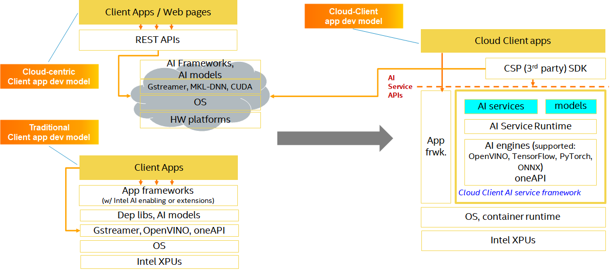

# 1. What is Intel Cloud-Client AI Service Framework (CCAI)

With the cloud-driven development model becoming more and more popular, we are also facing strong requirements to follow typical cloud applications development process and mode which can not only provide developer friendly experience but also keep and grow up our ecosystem significantly. Meanwhile, on the client side, Intel is providing more and more powerful hardware computation capability and introducing more flexible choice via various hardware accelerators to improve application performance. And specific to client AI usages, for making the non-AI expert developers enable AI features quickly and easily, reducing
additional efforts of setup different development environment, and simplifying the whole AI features development processing, a kind of high-level usage driven APIs/SDK can provide an abstraction of low-level AI inference framework but hide all in-depth AI related details so that developers can focus on their original business logics. Beyond this, we also need to keep the flexibility of customization for developing various services based on business requirements.
With all of the situations above considered, we build a set of APIs and its AI service framework which provide cloud-like APIs and hide all low level backend details, meanwhile leverage as much as possible those local client AI accelerators, so that we could treat the local client platform as an extension of remote cloud.

In brief, one AI services API framework with the same development mode like developing traditional cloud applications but get significant benefits from local client platforms as an inference platform with low latency, good privacy and independence to remote cloud and network bandwidth.

**Service** - abstract the AI capabilities as services APIs  
**Framework** - facilitate CSPs/ISVs to develop AI services for client  
**Client AI** - expose client HW AI capabilities to application developers  
**Cloud** - provide seamless dev experience for cloud/web app developers  
**Intel** - platform differentiating capability developed by Intel

