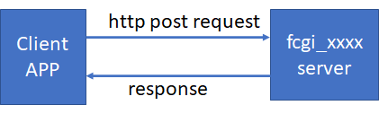
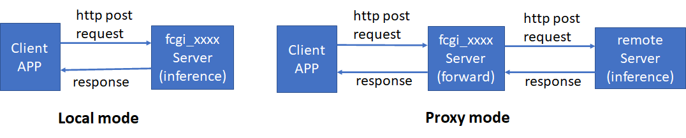
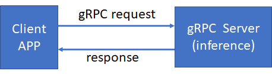
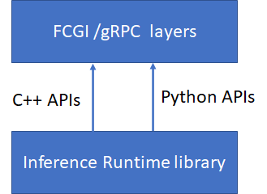
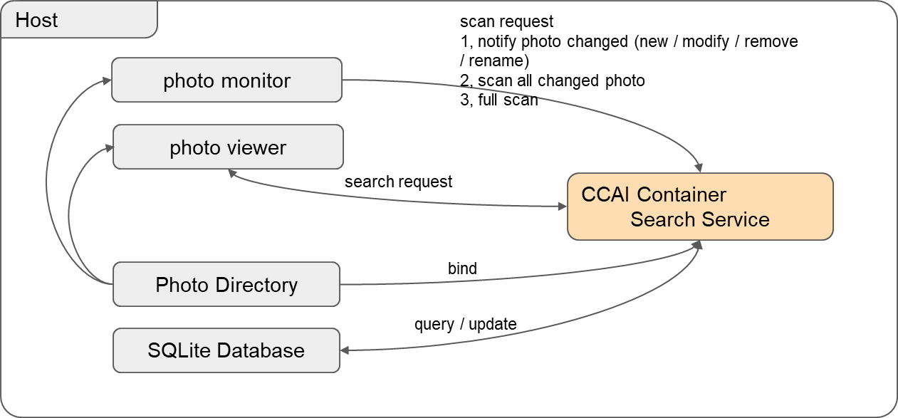

# 11. APIs Reference List

# 11.1 FCGI APIs Manual {#11.1}

CCAI provides many FCGI APIs. They are named fcgi_xxxx. Each fcgi API is a fcgi server, running in the background. Client APPs communicate with fcgi server by using http post protocol.



These fcgi APIs will do AI for different cases, such as classification, face detection, OCR, TTS, or ASR. Please refer to the following API list to understand the specific API.

Some fcgi APIs have two working modes. One mode is doing inference locally in the fcgi_xxxx server, the other one is proxy mode. In proxy mode, the fcgi_xxxx server forwards requests from client apps to the remote server (such as QQ server or Tencent server), the remote server does inference. In which mode the fcgi_xxxx server works is decided by configuration file (policy_setting.cfg) or the result of policy calculation.

The following picture shows two working modes.



Some FCGI APIs are implemented by two languages, C++ and python. So some APIs have two types of API: python API and C++ API. Both python API and C++ API provide the same functionality and parameters. The only difference is they have different http addresses. So clients' apps can get the same inference result from either FCGI C++ API or python API by using different addresses.

### 11.1.1 TTS API usage {# 11.1.1}

fcgi_tts API is used for text-to-speech. This is an end-to-end TTS API. Client app inputs one text sentence, fcgi_tts outputs the wave data of the text sentence. The wave data is the sound data. There are two paths for the wave data generated. The first path is that the wave data is written to a wav file. The second path is that the wave data is sent to the speakers directly, so you can hear the sentence from the speaker devices.

There are two working modes for fcgi_tts server, local mode and proxy mode.

Client app uses http protocol to communicate with fcgi_tts server.

The sample code of sending post request in client app is:

*response = requests.post(url, post_parameter)*

The following are the detailed information about request parameters and
response.

a) Input parameters

\- http url: such as: url= '<http://localhost:8080/cgi-bin/fcgi_py_tts>>'  
\- post parameter: this parameter should include these fields:

| **Field name** | **Type** | **Range**                              | **Example**       | **comments**                                                    |
|----------------|----------|----------------------------------------|-------------------|-----------------------------------------------------------------|
| 'aht'          | Int      | [-24, 24]                              | 0                 | increase(+)/descread(-) amount of semitone for generated speech |
| 'apc'          |  int     | [0,100]                                | 58                | Set the speaker's timbre                                        |
| 'app_id'       | Int      | Positive integer                       | 2128571502        | Application ID                                                  |
| 'format'       | Int      | Positive integer                       | 2                 | 1:PCM 2:WAV 3:MP3                                               |
| 'nonce_str'    | string   | No more than 32 byte                   | fa577ce340859f9fe | Random string                                                   |
| 'speaker'      | Int      | Positive integer                       | 1                 | 1: male voice 5: female voice                                   |
| 'speed'        | Int      | [50-200]                               | 100               | The speed of voice                                              |
| 'text'         | string   | Utf-8 encoding, No more than 150 bytes | Hello world       | The input text sentence                                         |
| 'time_stamp'   | Int      | Positive integer                       | 1493468759        | timestamp                                                       |
| 'volum'        | Int      | [-10, 10]                              | 0                 | volume                                                          |
| 'appkey'       | string   | string                                 | di6ik9b9JiYfImUB  | Application key                                                 |

In local mode(doing inference locally), only a "text" field is needed to set,
other fields are ignored.

In proxy mode(doing inference on a remote server), all fields are needed to set.

In proxy mode, 'appid' and 'appkey' are the necessary parameters in order to get
the right results from the remote server(www.ai.qq.com). You should register on
www.ai.qq.com and get 'appid' and 'appkey'. Please refer to
*<https://ai.qq.com/doc/aaitts.shtml>* , find out how to apply these fields and
how to write a post request for the remote server.

b) Response

The response of post request is json format, for example:

{

"ret": 0, //return value: 0 (success) or 1(failure)

"msg": "ok", // request result: "ok" or "inference failed"

"data": { //inference result

"format": 2, // the format of voice : 1(pcm) 2(wav) 3(mp3)

"speech": "UklGRjL4Aw..." // wave data of input sentence

"md5sum": "3bae7bf99ad32bc2880ef1938ba19590" //Base64 encoding of synthesized
speech

},

"time": 7.283 //fcgi_tts processing time

}

If the speaker devices are configured correctly, you can also hear the sentence
directly from the speakers.

One example of a client app for fcgi_tts API is
"*api-gateway/cgi-bin/test-script/test-demo/post_local_tts_py.py*".

c) Notice

Currently, this model only supports English text, not Chinese text.
It provides only python API.

To configure the speaker devices, you need to enable the pulseaudio and
health-monitor services by following the following steps:

(1) On the host PC, install the pulseaudio package if this package hasn't been
installed.

For example:

    #sudo apt-get install pulseaudio

(2) Enable the TCP protocol of the pulseaudio.

Edit the configuration file. for example:

    #sudo vim /etc/pulse/default.pa

Find out the following tcp configuration:

    #load-module module-native-protocol-tcp

Uncomment the tcp configuration(remove "    #"), and add authentication:

    load-module module-native-protocol-tcp auth-anonymous=1

Save and quit the configuration file.

(3) Restart the pulseaudio service. For example:
    Stop the pulseaudio:
        # pulseaudio -k
    Start the pulseaudio:
        #pulseaudio --start or #pulseaudio -D

(4) Running the health-monitor service on the host pc if you don't run it.
This service is used to monitor the CCAI container.

### 11.1.2 ASR API usage (offline ASR case) {#11.1.2}

fcgi_asr API is a usage of Automatic-Speech-Recognition. This is an end-to-end speech recognition. It includes several libraries released by the OpenVINO? toolkit. These libraries perform feature extraction, OpenVINO?-based neural-network speech recognition, and decoding to produce text from scores. All these libraries provide an end-to-end pipeline converting speech to text. Client app inputs an utterance (speech), fcgi_asr outputs the text directly expressed by this utterance.

fcgi_asr has only one working modes - local mode.

Client app uses http protocol to communicate with fcgi_asr server.

The sample code of sending post request in client app is:

*response = requests.post(url, post_parameter)*

The following are the detailed information about request parameters and
response.

a) Input parameters

\- http url: such as: url= 'http://localhost:8080/cgi-bin/fcgi_py_asr'

\- post parameter: this parameter should include these fields:

| **Field name** | **Type** | **Range**                        | **Example**       | **comments**                     |
|----------------|----------|----------------------------------|-------------------|----------------------------------|
| 'samplewidth'  | Int      | Positive integer                 | 2                 | 1:PCM 2:WAV 3:AMR 4:SILK         |
| 'rate'         | Int      | Positive integer                 | 16000             | sample frequency                 |
| 'language'     | string   | "ENGLISH" or "CHINESE"           | ENGLISH           | language type                    |
| 'realtime'     | string   | 'OFFLINE','ONLINE_READ','ONLINE_STOP' | OFFLINE      | working mode: offline or live asr|
| 'speech'       | string   | Utterance data. Usually PCM data |                   | Must be encoded by base64 method |
| 'audio_input'  | string   | 'SIMULATION' or 'MIC'            | SIMULATION        | Used in live asr mode.           |
| 'time_stamp'   | Int      | Positive integer                 | 1493468759        | Timestamp                        |

For offline mode, the "realtime" field should set to "OFFLINE", the "audio_input" field should set to "SIMULATION".
Because an audio file should be PCM WAV 16 kHz mono format in this case, the "samplewidth" field should be 2, and the
"rate" field should be 16000.

b) Response

The response of post request is json format, for example:

    {
    
        "ret":0, //return value: 0 (success) or 1(failure)
    
        "msg":"ok", // request result: "ok" or "inference error"
    
        "data":{ //inference result
    
            "text":HOW ARE YOU DOING //text
    
        },
    
        "time":0.695 //fcgi_asr processing time
    
    }

One example of a client app for fcgi_asr API is "*api-gateway/cgi-bin/test-script/test-demo/post_local_asr_py.py*".
   # python3 post_local_asr_py.py -l ENG -m Offline -f path_of_audio_file

c) Notice
This model supports both English utterance and Mathaland. For Mandarin model (IR format), please contact the author to get it.
Please refer to README.txt file under api-gateway/fcgi/asr/python folder. 

It provides only python API.

### 11.1.3 API in Speech sample {#11.1.3}

Fcgi_speech API is used for inference speech. The acoustic model is trained on
Kaldi* neural networks. The input speech data must be speech feature vectors.
The feature vector is ARK format (ARK file - the result of feature extraction).
The inference result is score data, which is also ARK format.

Client app uses http protocol to communicate with fcgi_speech server.

The sample of sending request in client app is:

*response = requests.post(url, post_parameter)*

The following is the detailed information about request parameters and response.

a) Input parameters

\- http url: such as: url= 'http://localhost:8080/cgi-bin/fcgi_speech'

\- post parameter: this parameter should include these fields:

| **Field name** | **Type** | **Value**                                                                               | **comments**                         |
|----------------|----------|-----------------------------------------------------------------------------------------|--------------------------------------|
| 'stage'        | string   | {'RAW_FORMAT_INIT', 'IR_FORMAT_INIT_NETWORK', 'IR_FORMAT_INIT_EXENETWORK', 'INFERENCE'} | Only have 4 items                    |
| 'model'        | string   | Example: './models/wsj_dnn5b.xml'                                                       | IR format file or no IR format model |
| 'batch'        | int      | Positive integer. Example: 1 or 8                                                       | Set based on the real case           |
| 'device'       | string   | Example: 'GNA_AUTO' or 'CPU'                                                            | Select the inference device          |
| 'scale_factor' | int      | Positive integer Example: 2048                                                          | Used for GNA HW                      |
| 'speech'       | string   | Speech input vector data                                                                | Must be encoded by base64 method     |
| 'time_stamp'   | int      | Positive integer                                                                        | Time stamp for this request.         |

The fcgi_speech uses a finite state machine to record the behavior. Client apps should use different 'stage' requests to trigger translation of fcgi_speech behavior.

For IR format model, the sample of post requests sequence is:

The First post request is init request:

    ['stage'] = 'IR_FORMAT_INIT_NETWORK'
    
    ['model'] = './models/wsj_dnn5b.xml'
    
    ['batch'] = 8

The second post request is also init request:

    ['stage'] = 'IR_FORMAT_INIT_EXENETWORK '
    
    ['model'] = './models/wsj_dnn5b.xml'
    
    ['device'] = 'GNA_AUTO'

The last post request is for inference:

    ['stage'] = 'INFERENCE'
    
    ['model'] = './models/wsj_dnn5b.xml'
    
    ['speech'] = base64_data

For IR format model, the sample of post requests sequence is: (two requests
only)

The First post request is init request:

    ['stage'] = 'RAW_FORMAT_INIT'
    
    ['model'] = './models/ELE_M.raw'
    
    ['batch'] = 1
    
    ['device'] = 'GNA_AUTO'
    
    ['scale_factor'] = 2048

The second post request which is also the last request is for inference:

    ['stage'] = 'INFERENCE'
    
    ['model'] = './models/ELE_M.raw'
    
    ['speech'] = base64_data

b) Response

The response of post request is json format, for example:

    {
    
        "ret":0, //return value: 0 (success) or 1(failure)
    
        "msg":"ok", // request result: "ok" or "inference error"
    
        "data":{ ... // inference result
    
        ...... // response data
    
        },
    
        "time":0.344222 //fcgi_speech processing time
    
    }

One example of a client app for fcgi_speech API is
"*api-gateway/cgi-bin/test-script/test-demo/post_local_speech_c.py*".

c) Notice

The fcgi_speech API doesn't have proxy mode. That means this API doesn't support doing inference on remote servers.

This API can use GNA_HW as a reference device.

It provides only C++ API.

### 11.1.4 Policy API usage {#11.1.4}

fcgi_policy API is used to select inference devices or working mode(local model or proxy mode) for fcgi APIs.

Client app uses http protocol to communicate with fcgi_policy server.

The sample of sending request in client app is:

*response = requests.post(url, post_parameter)*

The following is the detailed information about request parameters and response.

a) Input parameters

\- http url: such as: url= 'http://localhost:8080/cgi-bin/fcgi_policy'

\- post parameter: this parameter should include these fields.

| **Field name** | **Type** | **Value**                                                    | **comments**                                                 |
| -------------- | -------- | ------------------------------------------------------------ | ------------------------------------------------------------ |
| 'device'       | string   | CPU, GPU, GNA_AUTO, GNA_HW, GNA_SW                           | This field is used to set inference devices. Such as "GPU", "CPU" etc. |
| 'local'        | string   | "1" - do inference locally "0" - do inference on a remote server | Select working mode of fcgi server: local mode or proxy mode |

b) Response

The response of the post request is a string, which indicates whether the
request is processed correctly.

*"successfully set the policy daemon" // OK*

*"failed to set policy daemon" // Fail*

c) Notice

The policy daemon must be run, or else calling this API will fail.

Run this policy API before running any other case if you want to select an
inference device or change working mode of fcgi APIs.

This setting is a global setting. That means the setting will impact the
following cases.

It provides two types of APIs: C++ and python API.

### 11.1.5 Classification API usage {#11.1.5}

fcgi_classification API is used to run inference on an image, and produce the classification information for objects in the image. Client app inputs one picture(image), fcgi_classification outputs the object information, such as what the object is, and the coordinates of the object in the picture.

Same as fcgi_tts, fcgi_classification also has two working modes, locol mode and proxy mode.

Client app uses http protocol to communicate with fcgi_classification server.

The sample code of sending post request in client app is:

    response = requests.post(url, post_parameter)

The following are the detailed information about request parameters and
response.

a) Input parameters

\- http url: such as: url= 'http://localhost:8080/cgi-bin/fcgi_classfication'

\- post parameter: this parameter should include these fields:

| **Field name** | **Type** | **Range**                      | **Example**       | **comments**                     |
|----------------|----------|--------------------------------|-------------------|----------------------------------|
| 'app_id'       | Int      | Positive integer               | 2128571502        | Application ID                   |
| 'nonce_str'    | string   | No more than 32 byte           | fa577ce340859f9fe | Random string                    |
| 'image'        | string   | image data, often is a picture |                   | Must be encoded by base64 method |
| 'time_stamp'   | Int      | Positive integer               | 1493468759        | timestamp                        |
| 'appkey'       | string   | string                         | di6ik9b9JiYfImUB  | Application key                  |

In Local mode(doing inference locally), only an "image" field is needed to be set.

In proxy mode(doing inference on a remote server), all fields are needed to be set.

In proxy mode, 'appid' and 'appkey' are the necessary parameters in order to get the right results from the remote server(www.ai.qq.com). You should register on www.ai.qq.com and get 'appid' and 'appkey'. Please refer to *<https://ai.qq.com/doc/imagetag.shtml>* , find out how to apply these fields and how to write a post request for the remote server.

b) Response

The response of post request is json format, for example:

    {
    
        "ret":0,
    
        "msg":"ok",
    
        "data":{
    
            "tag_list":[
    
                {"tag_name":'sandal',"tag_confidence":0.786503}
    
            ]
    
        },
    
        "time":0.380
    
    }

One example of a client app for fcgi_classification API is
"*api-gateway/cgi-bin/test-script/test-demo/post_local_classification_c.py* ".

c) Notice

It provides two types of APIs: both C++ and python API.

### 11.1.6 Face Detection API usage {#11.1.6}

fcgi_face_detection API is used to run inference on an image, and find out human faces in the image. Client app inputs one picture(image), fcgi_face_detection
outputs the face information, such as how many human faces, and the bounding box
for each face in the picture.

Same as fcgi_tts, fcgi_face_detection also has two working modes, local mode and
proxy mode.

Client app uses http protocol to communicate with fcgi_face_detection server.

The sample code of sending post request in client app is:

*response = requests.post(url, post_parameter)*

The following are the detailed information about request parameters and
response.

a) Input parameters

\- http url: such as: url= 'http://localhost:8080/cgi-bin/fcgi_face_detection'

\- post parameter: this parameter should include these fields:

| **Field name** | **Type** | **Range**                      | **Example**       | **comments**                     |
|----------------|----------|--------------------------------|-------------------|----------------------------------|
| 'app_id'       | Int      | Positive integer               | 2128571502        | Application ID                   |
| 'nonce_str'    | string   | No more than 32 byte           | fa577ce340859f9fe | Random string                    |
| 'image'        | string   | image data, often is a picture |                   | Must be encoded by base64 method |
| 'time_stamp'   | Int      | Positive integer               | 1493468759        | timestamp                        |
| 'appkey'       | string   | string                         | di6ik9b9JiYfImUB  | Application key                  |

In Local mode(doing inference locally), only an "image" field is needed to be set.

In proxy mode(doing inference on a remote server), all fields are needed to be set.

In proxy mode, 'appid' and 'appkey' are the necessary parameters in order to get the right results from the remote server(www.ai.qq.com). You should register on www.ai.qq.com and get 'appid' and 'appkey'. Please refer to *<https://ai.qq.com/doc/detectface.shtml>* , find out how to apply these fields
and how to write a post request for the remote server.

b) Response

The response of post request is json format, for example:

    {
    
        "ret":0,
        "msg":"ok",
        "data":{
            "face_list":[
            {
                "x1":655,
                "y1":124,
                "x2":783,
                "y2":304
            },
            {
                "x1":68,
                "y1":149,
                "x2":267,
                "y2":367
            } ]
        },
        "time":0.305
    }

One example of a client app for fcgi_face_detection API is
"*api-gateway/cgi-bin/test-script/test-demo/post_local_face_detection_c.py* ".

c) Notice

It provides two types of API: both C++ and python API.

### 11.1.7 Facial Landmark API usage {#11.1.7}

fcgi_facial_landmark API is used to run inference on an image, and print human facial landmarks in the image. Client app inputs one picture(image), fcgi_facial_landmark outputs the coordinates of facial landmark points.

Same as fcgi_tts, fcgi_facial_landmark also has two working modes, local mode and proxy mode.

Client app uses http protocol to communicate with fcgi_facial_landmark server.

The sample code of sending post request in client app is:

*response = requests.post(url, post_parameter)*

The following are the detailed information about request parameters and response.

a) Input parameters

\- http url: such as: url= 'http://localhost:8080/cgi-bin/fcgi_facial_landmark'

\- post parameter: this parameter should include these fields:

| **Field name** | **Type** | **Range**                      | **Example**       | **comments**                     |
|----------------|----------|--------------------------------|-------------------|----------------------------------|
| 'app_id'       | Int      | Positive integer               | 2128571502        | Application ID                   |
| 'nonce_str'    | string   | No more than 32 byte           | fa577ce340859f9fe | Random string                    |
| 'image'        | string   | image data, often is a picture |                   | Must be encoded by base64 method |
| 'time_stamp'   | Int      | Positive integer               | 1493468759        | timestamp                        |
| 'appkey'       | string   | string                         | di6ik9b9JiYfImUB  | Application key                  |

In Local mode(doing inference locally), only an "image" field is needed to be set.

In proxy mode(doing inference on a remote server), all fields are needed to be set.

In proxy mode, 'appid' and 'appkey' are the necessary parameters in order to get the right results from the remote server(www.ai.qq.com). You should register on www.ai.qq.com and get 'appid' and 'appkey'. Please refer to
*<https://ai.qq.com/doc/detectface.shtml>* , find out how to apply these fields and how to write a post request for the remote server.

b) Response

The response of post request is json format, for example:

    {
    
        "ret":0,
    
        "msg":"ok",
    
        "data":{
    
            "image_width":916.000000,
    
            "image_height":502.000000,
    
            "face_shape_list":[
    
                {"x":684.691284,
    
                "y":198.765793},
    
                {"x":664.316528,
    
                "y":195.681824},
    
                ''
    
                {"x":241.314194,
    
                "y":211.847031} ]
    
        },
    
        "time":0.623
    
    }

One example of a client app for fcgi_facial_landmark API is "*api-gateway/cgi-bin/test-script/test-demo/post_local_facial_landmark_c.py* ".

c) Notice

It provides two types of API: both C++ and python API.

### 11.1.8 OCR API usage {#11.1.8}

fcgi_ocr API is used to run inference on an image, and recognize handwritten or printed text from an image. Client app inputs one picture(image), fcgi_ocr outputs the text information in the picture. The information includes text coordinations and text confidence.

Same as fcgi_tts, fcgi_ocr also has two working modes, local mode and proxy
mode.

Client app uses http protocol to communicate with fcgi_ocr server.

The sample code of sending post request in client app is:

*response = requests.post(url, post_parameter)*

The following are the detailed information about request parameters and
response.

a) Input parameters

\- http url: such as: url= 'http://localhost:8080/cgi-bin/fcgi_ocr'

\- post parameter: this parameter should include these fields:

| **Field name** | **Type** | **Range**                      | **Example**       | **comments**                     |
|----------------|----------|--------------------------------|-------------------|----------------------------------|
| 'app_id'       | Int      | Positive integer               | 2128571502        | Application ID                   |
| 'nonce_str'    | string   | No more than 32 byte           | fa577ce340859f9fe | Random string                    |
| 'image'        | string   | image data, often is a picture |                   | Must be encoded by base64 method |
| 'time_stamp'   | Int      | Positive integer               | 1493468759        | timestamp                        |
| 'appkey'       | string   | string                         | di6ik9b9JiYfImUB  | Application key                  |

In Local mode(doing inference locally), only an "image" field is needed to be set.

In proxy mode(doing inference on a remote server), all fields are needed to be set.

In proxy mode, 'appid' and 'appkey' are the necessary parameters in order to get the right results from the remote server(www.ai.qq.com). You should register on www.ai.qq.com and get 'appid' and 'appkey'. Please refer to
*<https://ai.qq.com/doc/imgtotext.shtml>* , find out how to apply these fields and how to write a post request for the remote server.

b) Response

The response of post request is json format, for example:

    {
    "ret":0,
    "msg":"ok",
    "data":{
    "item_list":[
    {
    "itemcoord":[
    {
    "x":161.903748,
    "y":91.755684,
    "width":141.737503,
    "height":81.645004
    }
    ],
    "words":[
    {
    "character":i,
    "confidence":0.999999
    },
    {
    "character":n,
    "confidence":0.999998
    },
    {
    "character":t,
    "confidence":0.621934
    },
    {
    "character":e,
    "confidence":0.999999
    },
    {
    "character":l,
    "confidence":0.999995
    } ],
    "itemstring":intel
    },
    {
    "itemcoord":[
    {
    "x":205.378326,
    "y":153.429291,
    "width":175.314835,
    "height":77.421722
    }
    ],
    "words":[
    {
    "character":i,
    "confidence":1.000000
    },
    {
    "character":n,
    "confidence":1.000000
    },
    {
    "character":s,
    "confidence":1.000000
    },
    {
    "character":i,
    "confidence":0.776524
    },
    {
    "character":d,
    "confidence":1.000000
    },
    
    {
    "character":e,
    "confidence":1.000000
    } ],
    "itemstring":inside
    } ]
    },
    "time":1.986
    }

One example of a client app for fcgi_ocr API is
"*api-gateway/cgi-bin/test-script/test-demo/post_local_ocr_c.py* ".

c) Notice

It provides two types of API: both C++ and python API.

### 11.1.9 formula API usage {#11.1.9}

fcgi_formula API is used to run inference on an image. It can recognize formulas and output formulas in latex format. Client app inputs one picture(image), fcgi_formula outputs the formula in latex format.

fcgi_formula has only one working mode, local mode.

Client app uses http protocol to communicate with fcgi_formula server.

The sample code of sending post request in client app is:

*response = requests.post(url, post_parameter)*

The following are the detailed information about request parameters and
response.

a) Input parameters

\- http url: such as: url= 'http://localhost:8080/cgi-bin/fcgi_py_formula'

\- post parameter: this parameter should include these fields:

| **Field name** | **Type** | **Range**                      | **Example**       | **comments**                     |
|----------------|----------|--------------------------------|-------------------|----------------------------------|
| 'app_id'       | Int      | Positive integer               | 2128571502        | Application ID                   |
| 'nonce_str'    | string   | No more than 32 byte           | fa577ce340859f9fe | Random string                    |
| 'image'        | string   | image data, often is a picture |                   | Must be encoded by base64 method |
| 'time_stamp'   | Int      | Positive integer               | 1493468759        | timestamp                        |
| 'appkey'       | string   | string                         | di6ik9b9JiYfImUB  | Application key                  |

In Local mode(doing inference locally), only an "image" field is needed to be set.

b) Response

The response of post request is json format, for example:
```
{'ret': 0, 'msg': 'ok', 'data': '1 1 1 v v ^ { 1 } + 7 . 7 9 o ^ { 1 } - o - 0 . 9 0 f ^ { 7 } s ^ { 7 }', 'time': 0.518}
```
One example of a client app for fcgi_ocr API is
"*api-gateway/cgi-bin/test-script/test-demo/post_local_formula_py.py* ".

c) Notice

It provides only python API.

### 11.1.10 handwritten API usage {#11.1.10}

fcgi_handwritten API is used to run inference on an image, and recognize handwritten chinese from an image. Client app inputs one picture(image), fcgi_handwritten outputs the text information in the picture.

fcgi_handwritten has one working mode, local mode.

Client app uses http protocol to communicate with fcgi_handwritten server.

The sample code of sending post request in client app is:

*response = requests.post(url, post_parameter)*

The following are the detailed information about request parameters and
response.

a) Input parameters

\- http url: such as: url= 'http://localhost:8080/cgi-bin/fcgi_py_handwritten'

\- post parameter: this parameter should include these fields:

| **Field name** | **Type** | **Range**                      | **Example**       | **comments**                     |
|----------------|----------|--------------------------------|-------------------|----------------------------------|
| 'app_id'       | Int      | Positive integer               | 2128571502        | Application ID                   |
| 'nonce_str'    | string   | No more than 32 byte           | fa577ce340859f9fe | Random string                    |
| 'image'        | string   | image data, often is a picture |                   | Must be encoded by base64 method |
| 'time_stamp'   | Int      | Positive integer               | 1493468759        | timestamp                        |
| 'appkey'       | string   | string                         | di6ik9b9JiYfImUB  | Application key                  |

In Local mode(doing inference locally), only an "image" field is needed to be set.

b) Response

The response of post request is json format, for example:

    {'ret': 0, 'msg': 'ok', 'data': '的人不一了是他有为在责新中任自之我们', 'time': 0.405}

One example of a client app for fcgi_handwritten API is
"*api-gateway/cgi-bin/test-script/test-demo/post_local_handwritten_py.py* ".

c) Notice

It provides only python API.

### 11.1.11 ppocr API usage {#11.1.11}

fcgi_ppocr API is used to run inference on an image, and recognize printed text from an image. Client app inputs one picture(image), fcgi_ppocr outputs the text information in the picture.

fcgi_ppocr has one working mode, local mode.

Client app uses http protocol to communicate with fcgi_ppocr server.

The sample code of sending post request in client app is:

*response = requests.post(url, post_parameter)*

The following are the detailed information about request parameters and
response.

a) Input parameters

\- http url: such as: url= 'http://localhost:8080/cgi-bin/fcgi_py_ppocr'

\- post parameter: this parameter should include these fields:

| **Field name** | **Type** | **Range**                      | **Example**       | **comments**                     |
|----------------|----------|--------------------------------|-------------------|----------------------------------|
| 'app_id'       | Int      | Positive integer               | 2128571502        | Application ID                   |
| 'nonce_str'    | string   | No more than 32 byte           | fa577ce340859f9fe | Random string                    |
| 'image'        | string   | image data, often is a picture |                   | Must be encoded by base64 method |
| 'time_stamp'   | Int      | Positive integer               | 1493468759        | timestamp                        |
| 'appkey'       | string   | string                         | di6ik9b9JiYfImUB  | Application key                  |

In Local mode(doing inference locally), only an "image" field is needed to be set.

b) Response

The response of post request is json format, for example (OCR result with chinese characters):

    {'ret': 0, 'msg': 'ok', 'data': ' 的人不一了是他有为在责新中任自之我们\n 的人不一了是他有为在责新中任自之我们\n 4 7 4 W ^ { 1 } + 7 . 1 9 o ^ { 4 } - 6 - 0 . 9 6 L ^ { 1 } U\n 区是我国载人航天工程立项实施以来的第19次飞行任务，也是空间站阶段的首次载\n 人飞行任务。飞船入轨后，将按照预定程序，与大和核心舱进行自主快速交会对接\n 自合体飞行期间，航大员将进驻大和核心能，完成为期3个月的在轨驻留，开展机械\n 操作、出舱活动等工作，验证航大员长期在轨驻留、再生生保等一系列关键技术\n 自前，大和核心舱与大舟二号的组合体运行在�?90km的近圆对接轨道，状态良\n 好，满足与神舟十二号交会对接的任务要求和航大员进驻条件\n 震撼！神舟十二号与地球同框\n 神舟十二号载人飞船升空过程中，舱�?名航天员状态良好，推进舱外摄像机拍摄全\n 了神舟十二号与地球同框震想面面\n 自关报道：神舟十二号载人飞船飞行乘组确定！他们在太空将怎样生活3个月\n', 'time': 0.308}

One example of a client app for fcgi_ppocr API is
"*api-gateway/cgi-bin/test-script/test-demo/post_local_ppocr_py.py* ".

c) Notice

It provides only python API.

### 11.1.12 segmentation API usage {#11.1.12}

fcgi_segmentation API is used to run inference on an image, and recognize semantic segmentation from an image. Client app inputs one picture(image), fcgi_segmentation outputs a semantic segmentation picture.

fcgi_segmentation has one working mode, local mode.

Client app uses http protocol to communicate with fcgi_segmentation server.

The sample code of sending post request in client app is:

*response = requests.post(url, post_parameter)*

The following are the detailed information about request parameters and response.

a) Input parameters

\- http url: such as: url= 'http://localhost:8080/cgi-bin/fcgi_segmentation'

\- post parameter: this parameter should include these fields:

| **Field name** | **Type** | **Range**                      | **Example**       | **comments**                     |
|----------------|----------|--------------------------------|-------------------|----------------------------------|
| 'app_id'       | Int      | Positive integer               | 2128571502        | Application ID                   |
| 'nonce_str'    | string   | No more than 32 byte           | fa577ce340859f9fe | Random string                    |
| 'image'        | string   | image data, often is a picture |                   | Must be encoded by base64 method |
| 'time_stamp'   | Int      | Positive integer               | 1493468759        | timestamp                        |
| 'appkey'       | string   | string                         | di6ik9b9JiYfImUB  | Application key                  |

In Local mode(doing inference locally), only an "image" field is needed to be set.

b) Response

The response of post request is json format, for example:

    { "ret": 0, "msg": "ok", "data":
    "b'AAAAAAAAAAAAAAAAAAAAAAAAAAAAAAAAAAAAAAAAAAAAAAAAAAAAAAAAAAAAAAAAAAAAAAAAAAAAAAAAAAAAAAAAAAAAAAAAAAAAAAAAAAAAAAAAAAAAAAAAAAAAAAAAAAAAAAAAAAAAAAAAAAAAAAAAAAAAAAAAAAAAAAAAAAAAAAAAAAAAA...AABwQQAAcEEAAHBBAABwQQAAcEEAAHBBAABwQQAAcEEAAHBBAABwQQAAcEEAAHBBAABwQQAAcEEAAHBBAABwQQAAcEEAAHBBAABwQQAAcEEAAHBBAABwQQAAcEEAAHBBAABwQQAAcEEAAHBBAABwQQAAcEEAAHBBAABwQQAAcEEAAHBB'","time":
    0.31}

One example of a client app for fcgi_segmentation API is
"*api-gateway/cgi-bin/test-script/test-demo/post_local_segmentation_c.py* ".

c) Notice

It provides two types of API: both C++ and python API.

### 11.1.13 super resolution API usage {#11.1.13}

fcgi_super_resolution API is used to run inference on an image, and convert a small picture to a large picture. Client app inputs one picture(image), fcgi_super_resolution outputs a large picture.

fcgi_super_resolution has one working mode, local mode.

Client app uses http protocol to communicate with fcgi_super_resolution server.

The sample code of sending post request in client app is:

*response = requests.post(url, post_parameter)*

The following are the detailed information about request parameters and
response.

a) Input parameters

\- http url: such as: url= 'http://localhost:8080/cgi-bin/fcgi_super_resolution'

\- post parameter: this parameter should include these fields:

| **Field name** | **Type** | **Range**                      | **Example**       | **comments**                     |
|----------------|----------|--------------------------------|-------------------|----------------------------------|
| 'app_id'       | Int      | Positive integer               | 2128571502        | Application ID                   |
| 'nonce_str'    | string   | No more than 32 byte           | fa577ce340859f9fe | Random string                    |
| 'image'        | string   | image data, often is a picture |                   | Must be encoded by base64 method |
| 'time_stamp'   | Int      | Positive integer               | 1493468759        | timestamp                        |
| 'appkey'       | string   | string                         | di6ik9b9JiYfImUB  | Application key                  |

In Local mode(doing inference locally), only an "image" field is needed to be set.

b) Response

The response of post request is json format, for example

    {"ret":0,
    "msg":"ok","data":"/////+rX//////vm+9/K/uPO/+PO/+jU/+3a//Lf//Tg//fj//Tg//3o//3p//nm/+7a/+vY/+3a/+/d/+7c//Xj//jl//jm//De//Hf//Th//Ti//Ph//7r///s//nn/+7c/+/e/+/c/+rX/+LO/+le:...AAAAAAAAAAAAAAAAAAAAAACggDHx4ZLS0oMzMwNjc3tQ==",
    "time":0.238}

One example of a client app for fcgi_super_resolution API is
"*api-gateway/cgi-bin/test-script/test-demo/post_local_super_resolution_c.py* ".

c) Notice

It provides two types of API: both C++ and python API.

### 11.1.14 digitalnote API usage {#11.1.14}

digitalnote API is used to run inference on an image, .Recognize and output the handwriting, machine writing and formulas in the picture. Client app inputs one picture(image), fcgi_digitalnote outputs the handwriting, machine writing and formulas in the picture.

fcgi_digitalnote only has local mode and does not have remote mode.

Client app uses http protocol to communicate with fcgi_digitalnote server.

The sample code of sending post request in client app is:

*response = requests.post(url, post_parameter)*

The following are the detailed information about request parameters and
response.

a) Input parameters

\- http url: such as: url= 'http://localhost:8080/cgi-bin/fcgi_digitalnote'

\- post parameter: this parameter should include these fields:

| Field name    | Type   | Range                          | Example           | comments                                |
|---------------|--------|--------------------------------|-------------------|-----------------------------------------|
| 'app_id'      | Int    | Positive integer               | 2128571502        | Application ID                          |
| 'nonce_str'   | string | No more than 32 byte           | fa577ce340859f9fe | Random string                           |
| 'image'       | string | image data, often is a picture |                   | Must be encoded by base64 method        |
| 'time_stamp'  | Int    | Positive integer               | 1493468759        | timestamp                               |
| 'appkey'      | string | string                         | di6ik9b9JiYfImUB  | Application key                         |
| 'latex'       | string | string                         | "365 234 "        | Pixel coordinates of latex              |
| 'handwritten' | string | string                         | "354 39 431 123 " | Pixel coordinates of latex              |
| 'html'        | int    | {0,1}                          | 0                 | 0 for terminal client 1 for html client |

In Local mode(doing inference locally), "image" field ,formula, latex and html are needed to be set. Find the coordinates of a pixel in the formula from the picture and fill in the latex field. Find the coordinates of a pixel in the handwritten from the picture and fill in the handwritten field. Use spaces to connect coordinates. If you use a terminal client the html field is 0.

b) Response

The response of post request is json format, for example

    {'ret': 0, 'msg': 'ok', 'data': '的人不一了是他有为在责新中任自之我们\n 的人不一了是他有为在责新中任自之我们\n 4 7 4 W ^ { 1 } + 7 . 1 9 o ^ { 4 } - 6 - 0 . 9 6 L ^ { 1 } U\n 区是我国载人航天工程立项实施以来的第19次飞行任务，也是空间站阶段的首次载\n 人飞行任务。飞船入轨后，将按照预定程序，与大和核心舱进行自主快速交会对接\n 自合体飞行期间，航大员将进驻大和核心能，完成为期3个月的在轨驻留，开展机械\n 操作、出舱活动等工作，验证航大员长期在轨驻留、再生生保等一系列关键技术\n 自前，大和核心舱与大舟二号的组合体运行在�?90km的近圆对接轨道，状态良\n 好，满足与神舟十二号交会对接的任务要求和航大员进驻条件\n 震撼！神舟十二号与地球同框\n 神舟十二号载人飞船升空过程中，舱�?名航天员状态良好，推进舱外摄像机拍摄全\n 了神舟十二号与地球同框震想面面\n 自关报道：神舟十二号载人飞船飞行乘组确定！他们在太空将怎样生活3个月\n ',
    'time': 1.095}

One example of a client app for fcgi_super_resolution API is
"*api-gateway/cgi-bin/test-script/test-demo/post_local_digitalnote_c.py* ".

c) Notice

It only provides python API.

It can speed up the inference. The picture does not need to be sent three times
to get three different results. Handwriting, machine writing and formula can be
called by one request.

### 11.1.15 Video pipeline management (control) API usage {#11.1.15}

Video pipeline API is used to start, stop a video pipeline or read something
from a video pipeline.

The following are the detailed information about request parameters and
response.

a) Request

\- url: '<http://localhost:8080/cgi-bin/streaming>>'

\- Content-Type: application/json

\- JSON object fields:

| Field name  | Type   | Range                   | Example                                                      | comments                               |
| ----------- | ------ | ----------------------- | ------------------------------------------------------------ | -------------------------------------- |
| "pipeline"  | string | string                  | "launcher.object_detection"                                  |                                        |
| "method"    | string | "start"/ "stop"/ "read" | "start"                                                      |                                        |
| "parameter" | string | JSON string             | "{ "source":"device=/dev/video0", "sink":"v4l2sink device=/dev/video2", "resolution":"width=800,height=600", "framerate':'inference-interval=1"  }" | optional, example is the default value |

\- example:

    $> curl -H "Content-Type:application/json" -X POST \
    
    http://localhost:8080/cgi-bin/streaming -d \
    
    '{"pipeline":"launcher.object_detection", "method":"start"}'

b) Response

For the start/stop method, the response is a string, "0" means success, "1" means failure.

For the read method, the response is the string of reading content.

### 11.1.16 Live ASR API usage (online ASR case) {#11.1.16}

The fcgi live asr API is also a usage of Automatic-Speech-Recognition. It uses the same models as fcgi_asr API(ASR API usage in 11.1.2). The difference is that this API is an online ASR case while 11.1.2 is an offline ASR case. That means this live asr API continuously captures the voice from the MIC devices, do inference, and send out the sentences what the voice expressed. It is online working model of the fcgi_asr service.

fcgi_live_asr case has only one working mode - local mode. It doesn't support proxy mode.

Client app uses http protocol to communicate with fcgi_asr server.

The sample code of sending post request in client app is:

*response = requests.post(url, post_parameter)*

The following are the detailed information about request parameters and
response.

a) Input parameters

\- http url: such as: url= 'http://localhost:8080/cgi-bin/fcgi_py_asr'

\- post parameter: this parameter should include these fields:
For parameters, please refer to 11.1.2.

For online mode, the "realtime" field should set to 'ONLINE_READ' or 'ONLINE_STOP'. 'ONLINE_READ' is used to query ASR inference result on time. 'ONLINE_STOP' is used to stop live asr mode. The "audio_input" field should set to "MIC" if the audio data is feed from MIC device. "SIMULATION" is used to verify live asr mode, and audio data is feed from a audio file which simulates the data from the mic device.


b) Response

The response of post request is json format, for example:

    HOW ARE YOU DOING
    
    HELLO
    
    HA
    
    ''''..
    
    Stop live asr ok!

One example of a client app for fcgi live asr API is
"*api-gateway/cgi-bin/test-script/test-demo/post_local_asr_py.py*".
     # python3 post_local_asr_py.py -l ENG -m Online -i MIC

c) Notice

This case supports both English utterance and Mathaland.
For Mandarin model (IR format), please contact the author to get it.

It only provides python APIs.

In order to use this API, you need to enable the pulseaudio and health-monitor
services.

(1) On the host PC, install the pulseaudio package if this package hasn't been installed.

For example:

    #sudo apt-get install pulseaudio

(2) Enable the TCP protocol of the pulseaudio.

Edit the configuration file. for example:

    #sudo vim /etc/pulse/default.pa

Find out the following tcp configuration:

    #load-module module-native-protocol-tcp

Uncomment the tcp configuration(remove "    #"), and add authentication:

    load-module module-native-protocol-tcp auth-anonymous=1

Save and quit the configuration file.

(3) Restart the pulseaudio service. For example:

    Stop the pulseaudio:

         # pulseaudio -k

    Start the pulseaudio:

         #pulseaudio --start or #pulseaudio -D

(4) Running the health-monitor service on the host pc if you don't run it.

This service is used to monitor the CCAI container.

### 11.1.17 Pose estimation API usage {#11.1.17}

Pose estimation API is a specific usage of video pipeline management API(11.1.15).

This estimation API is used to estimate the human pose status, such as head
status, shoulder status, body status or eye status. The client app can get the status and detect whether the current pose is a correct pose by calling this API.

Please refer to the section 11.1.15 for the detailed information of video pipeline management API.

In this API, the client app uses http protocol to communicate with fcgi_streaming server.

The host side must run X server in order to display video. Before running this case,  the following command must be executed on the host side to enable X server:
         #xhost +


The sample code of sending post request in client app is:

*response = requests.post(url, post_parameter)*

The following are the detailed information about request parameters and response.

a) Input parameters

\- http url: such as: url= 'http://localhost:8080/cgi-bin/streaming'

\- post parameter: this parameter should include these fields:

| **Field name** | **Type** | **Range**               | **Content**                                                  | **comments**                                                 |
| -------------- | -------- | ----------------------- | ------------------------------------------------------------ | ------------------------------------------------------------ |
| "pipeline"     | string   | string                  | "launcher.pose_estimation"                                   |                                                              |
| "method"       | string   | "start"/ "stop"/ "read" | "start' "read" "stop"                                        | Start pipeline/ Read pipeline/ Stop pipeline                 |
| "parameter"    | string   | JSON string             | "{ "source":"device=/dev/video0",  "sink":"fpsdisplaysink video-sink=ximagesink sync=false",  "framerate':'inference-interval=1"  }" | For the start method, it must have this parameter field; for the read/stop method, this parameter field is optional. |

b) Response

The response of post request is json format.

For the start/stop method, the response is a string, "0" means success, "1" means failure.

For the read method, the response is the string of reading content, like the
following string:

    {
        "Person0":{
            "available status":"63",
            "header status":"OK",
            "header angles":{
            "angle_y":-0.037771,
            "angle_p":0.230196,
            "angle_r":-1.108361
        },
        "shoulder status":"OK",
        "shoulder angle with horizontal": 1,
        "header to shoulder status":"OK",
        "header-to-shoulder angle": 91,
        "left eye status":"Open",
        "right eye status":"Open",
        "body status":"OK"
        }
    }

One example of a client app for pose estimation API is
"*api-gateway/fcgi/streaming/cpp/post_local_streaming_c.py*".

c) Notice

•	It only provides C++ APIs. 

•	Must running the following command in the host side before running pose estimation case.
                               #xhost +
•	The host side must run X server for display. Please install the following package in the host side. 
                               # sudo apt-get install x11-xserver-utils


# 11.2 gRPC APIs Manual {#11.2}

CCAI framework not only provides FGCI APIs, but also provides many gRPC APIs.
Client APPs can do inference by calling gRPC APIs.



The following are detailed gRPC APIs.

### 11.2.1 proto file {#11.2.1}

```
syntax = "proto3";
package inference_service;
service Inference {  
    rpc OCR (Input) returns (Result) {}  
    rpc ASR (Input) returns (Result) {}  
    rpc Classification (Input) returns (Result) {}  
    rpc FaceDetection (Input) returns (Result) {}  
    rpc FacialLandmark (Input) returns (Result) {} 
    } 
message Input {  
    bytes buffer = 1; 
    } 
message Result {  
    string json = 1; 
    } 
```


In the .proto file the service interface, 'Inference', is defined, and rpc methods, 'OCR', 'Classification', 'FaceDetection', 'FacialLandmark' and 'ASR' are defined inside the service.

### 11.2.2 OCR method {#11.2.2}

Request:

message Input

| **Field name** | **Type** | **Value** | **comments**                   |
|----------------|----------|-----------|--------------------------------|
| buffer         | bytes    |           | .jpg or .png image file buffer |

Response:

message, Result

| **Field name** | **Type** | **Value**                                                                                                                                                                                                  | **comments**                    |
|----------------|----------|------------------------------------------------------------------------------------------------------------------------------------------------------------------------------------------------------------|---------------------------------|
| json           | string   | example: [  {  "itemcoord":{  "x":162,  "y":91,  "width":141,  "height":81  },  "itemstring":"intel"  },  {  "itemcoord":{  "x":205,  "y":153,  "width":175,  "height":77  },  "itemstring":"inside"  } ]  | the field is json format string |

### 11.2.3 ASR method {#11.2.3}

Request:

message Input

| **Field name** | **Type** | **Value** | **comments**     |
|----------------|----------|-----------|------------------|
| buffer         | bytes    |           | .wav file buffer |

Response:

message Result

| **Field name** | **Type** | **Value**                                | **comments**                    |
|----------------|----------|------------------------------------------|---------------------------------|
| json           | string   | example: {  "text":"HOW ARE YOU DOING" } | the field is json format string |

### 11.2.4 Classification method {#11.2.4}

Request:

message Input

| **Field name** | **Type** | **Value** | **comments**                   |
|----------------|----------|-----------|--------------------------------|
| buffer         | bytes    |           | .jpg or .png image file buffer |

Response:

message, Result

| **Field name** | **Type** | **Value**                                                        | **comments**                    |
|----------------|----------|------------------------------------------------------------------|---------------------------------|
| json           | string   | example: [  { "Tag_name":"sandal","tag_confidence":0.743236  } ] | the field is json format string |

### 11.2.5 FaceDetection method {#11.2.5}

Request:

message Input

| **Field name** | **Type** | **Value** | **comments**                   |
|----------------|----------|-----------|--------------------------------|
| buffer         | bytes    |           | .jpg or .png image file buffer |

Response:

message, Result

| **Field name** | **Type** | **Value**                                                                                | **comments**                    |
|----------------|----------|------------------------------------------------------------------------------------------|---------------------------------|
| json           | string   | example: [ {"x1":611,"y1":106,"x2":827,"y2":322}, {"x1":37,"y1":128,"x2":298,"y2":389} ] | the field is json format string |

### 11.2.6 FacialLandmark method {#11.2.6}

Request:

message Input

| **Field name** | **Type** | **Value** | **comments**                   |
|----------------|----------|-----------|--------------------------------|
| buffer         | bytes    |           | .jpg or .png image file buffer |

Response:

message, Result

| **Field name** | **Type** | **Value**                                             | **comments**                    |
|----------------|----------|-------------------------------------------------------|---------------------------------|
| json           | string   | example: [ {"x":684,"y":198}, {"x":664,"y":195},  ' ] | the field is json format string |

# 11.3 Low level APIs Manual {#11.3}

Runtime service library provides APIs for upper layers, such as for fcgi or grpc
layer etc. Runtime library supports different inference engines, such as
Openvino or Pytorch. But the runtime library only provides one set of APIs to
the upper layer. Upper layers select the inference engine by passing parameters
to runtime APIs.

Runtime APIs are *"simple"* APIs. *"simple"* means the number of APIs is
limited. Although a few APIs, you can call these APIs to do inference for many cases, such as processing image, speech, or video etc. *"simple"* also means they can be used friendly and easily. For example, if you want to do inference on an image, you can finish this work by calling only one API, vino_ie_pipeline_infer_image(). You need not care about how to build up inference pipelines. They are opaque to the end user. All building work is done in the Runtime library.

The runtime service library APIs are implemented by two kinds of languages, C++ and python. So it provides two types of APIs. One type is C++ APIs, it can be called by C++ programs directly. Another is python APIs, it is prepared for python programs.



**Notice:**

There are two versions of C++ API. Version 0 is described in section 10.3.1(C++ APIs for Openvino Backend Engine). It only supports Openvino as an inference engine, and doesn't support pytorch engine.

Version 1 is described in section 10.3.3(C++ APIs for Different backend Engines). It supports both Openvino and Pytorch engie. Some APIs in version 0 can be replaced by APIs in version 1.

Some C++ APIs in version 0 will be deprecated in the future. I encourage you to try to use C++ APIs in version 1 if APIs in version 0 are marked "deprecated".

### 11.3.1 C++ APIs for Openvino Backend Engine(Version 0)  {#11.3.1}

#### 11.3.1.1 Return value (deprecated)  {#11.3.1.1}
```
*/***

**@brief Status code of inference*

**/*

#define RT_INFER_ERROR  -1 //inference error*
#define RT_LOCAL_INFER_OK   0 //inference successfully on local*
#define RT_REMOTE_INFER_OK  1 //inference successfully on remote server*
```
Some APIs have two work modes. One mode is local mode, which means doing inference on local XPU. Another is proxy mode. In proxy mode, API forwards requests to the remote server (such as QQ server or Tecent server). The remote server does inference.

In local mode, the return value is

    RT_LOCAL_INFER_OK (success)* or *RT_INFER_ERROR (failure).

In proxy mode, the return value is

    RT_REMOTE_INFER_OK (success)* or *RT_INFER_ERROR(failure)

#### 11.3.1.2 Server parameter  {#11.3.1.2}

    /***
    
    ** @brief This is the parameters to do inference on remote server*
    
    **/*
    
    struct serverParams {
        std::string url;  //the address of server
        std::string urlParam; //the post parameter of request
        std::string response; //the response data of server
    };

This parameter is used by API in proxy mode. Set server address(serverParams.url) and request(serverParams.urlParam), get server response(serverParams.response).

The example of usage:

    std::string param = "f=8&rsv_bp=1&rsv_idx=1&word=picture&tn=98633779_hao_pg";
    
    struct serverParams urlInfo{"https://www.intel.cn/index.html", param};
    
    ''''do inference on remote servers ''''''
    //get server response
    std::cout << urlInfo.response << std::endl;

#### 11.3.1.3 Policy configuration API  {#11.3.1.3}

This API is used by users to change API behavior. Users can set API working mode
(such as local mode or proxy mode), or assign inference devices (XPU) in local
mode.

1) API
```
    /***

    ** @brief Set parameters to configure vino ie pipeline

    ** @param configuration Parameters set from the end user.

    **/

    int vino_ie_pipeline_set_parameters(struct userCfgParams& configuration);
```
2) parameter
```
    /***
    ** @brief This is the parameters setting from end user*
    **/

    struct userCfgParams {
        bool isLocalInference; //do inference in local or remote
        std::string inferDevice; //inference device: CPU, GPU or other device
    };

isLocalInference: true -C local mode, do inference in local XPU.

False -C proxy mode, do inference on remote server.

inferDevice: inference device in local mode, you can select: CPU, GPU, GNA_AUTO etc.
```
3) example

```
struct userCfgParams cfg{true, "CPU"};

int res = vino_ie_pipeline_set_parameters(cfg);
```

4) Notice

This API setting is a global setting. That means this setting affects all the following APIs behaviors.

#### 11.3.1.4 image API (deprecated)  {#11.3.1.4}

This API is used to do inference on images. It is related to image processing.

1) API
```
/***

* @brief Do inference for image
* @param image Images input for network
* @param additionalInput Other inputs of network(except image input)
* @param xmls Path of IE model file(xml)
* @param rawDetectionResults Outputs of network, they are raw data.
* @param remoteSeverInfo parameters to do inference on remote serve
* @return Status code of inference
*/

int vino_ie_pipeline_infer_image(std::vector<std::shared_ptr<cv::Mat>>& image,

std::vector<std::vector<float>>& additionalInput,

std::string xmls,

std::vector<std::vector<float>*>& rawDetectionResults,

struct serverParams& remoteServerInfo);
```
2) parameter

| **Parameter**       | **Type**                               | **Comments**                                                 |
| ------------------- | -------------------------------------- | ------------------------------------------------------------ |
| image               | std::vector <std::shared_ptr<cv::Mat>> | The input data of the image. The data format of the image is cv::Mat. The input is a batch of images. The batch is expressed by std::vector<>. The vector size is batch size. Each item in the vector is a shared pointer, std::shared_ptr<cv::Mat>, which points to one image data in the batch. |
| additionalInput     | std::vector <std::vector<float>>       | For some networks, they have more than one input. This parameter is used for other inputs except image input. The type is also std::vector<>. Vector size is the number of inputs in a network except image input. For each input, the input data type is std::vector<float>. |
| xml                 | std::string                            | The IE model file, which includes the file path. The file must be xml format. |
| rawDetectionResults | std::vector <std::vector<float>*>      | The inference results. For some networks, they have more than one output port. This parameter is defined to std::vector<>. The vector size is the number of output ports. Each item in the vector is a pointer, which points to a vector(std::vector<float>), this vector is the inference result of one output port. |
| remoteServerInfo    | struct serverParams                    | Server parameter. This is used in proxy mode. Please refer to 1.2 for detailed information. |

3) example

```
std::string img_file = "./models/person-detection-retail-0013.png";

std::string model_file = "./models/person-detection-retail-0013.xml";

std::vector<float> rawDetectionResult;

std::vectorstd::vector<float> additionalInput;

std::vectorstd::vector<float> rawDetectionResults;*

rawDetectionResults.push_back(&rawDetectionResult);

std::vectorstd::shared_ptrcv::Mat images;

std::shared_ptrcv::Mat frame_ptr =
std::make_sharedcv::Mat(cv::imread(img_file, cv::IMREAD_COLOR));

images.push_back(frame_ptr);

std::string param = "f=8&rsv_bp=1&rsv_idx=1&word=picture&tn=98633779_hao_pg";
// = "test";

struct serverParams urlInfo{"https://www.intel.cn/index.html", param};

int res = vino_ie_pipeline_infer_image(images, additionalInput, model_file, rawDetectionResults, urlInfo);

```

4) Notice

Parameter - additionalInput: don't support cv::Mat data format.

#### 11.3.1.5 ASR API (deprecated)  {#11.3.1.5}

ASR means Automatic Speech Recognition, speech-to-text. This API is implemented
based on some Intel speech libraries.

Notice, from this release, this API isn't supported any longer. Please don't use it any more

1) API

```
/**

* @brief Do inference for speech (ASR). Using intel speech libraries.

* @param samples Speech data buffer.

* @param sampleLength Buffer size of speech data

* @param bytesPerSample Size for each speech sample data (how many bytes for
each sample)

* @param rh_utterance_transcription Text result of speech. (ASR result)

* @param remoteSeverInfo parameters to do inference on remote server.

* @return Status code of inference

*/

int vino_ie_pipeline_infer_speech(const short samples,*
int sampleLength,
int bytesPerSample,
std::string config_path,
std::vector<char> &rh_utterance_transcription,
struct serverParams& remoteServerInfo);
```


2) parameters

| **Parameter**              | **Type**            | **Comments**                                                                                                                 |
|----------------------------|---------------------|------------------------------------------------------------------------------------------------------------------------------|
| samples                    | short int           | speech data, which format is PCM data. Each short int data is one PCM sample.                                                |
| sampleLength               | int                 | The size of speech data                                                                                                      |
| bytesPerSample             | int                 | the bytes number for each speech sample data. For PCM data, the value should be 2, which means each PCM sample is two bytes. |
| config_path                | std::string         | The configuration file for the ASR model. This configuration file is used by intel speech libraries                          |
| rh_utterance_transcription | std::vector<char> | the inference result for speech data. The data format is char.                                                               |
| remoteServerInfo           | struct serverParams | Server parameter. This is used in proxy mode. Please refer to 1.2 for detailed information.                                  |

Samples, sampleLength, and bytesPerSample are often obtained by parsing theheader of a wave file.

3) example
No eample code.

4) Notice

From this release(V1.3), this API isn't supported any longer.
Please don't use it any more.

#### 11.3.1.6 common API (deprecated)  {#11.3.1.6}

"Common" means this API is used for cases other than image and ASR. For example,
the TTS case. If the input/output data of the model meet the requirements of
API, then this API can be used in this case.

1) API

```
/**

* @brief Do inference for common models

* @param inputData Data input for network. The data type is float.

* @param additionalInput Other inputs of network(except image input)

* @param xmls Path of IE model file(xml)

* @param rawDetectionResults Outputs of network, they are raw data.

* @param remoteSeverInfo parameters to do inference on remote server

* @return Status code of inference

*/

int vino_ie_pipeline_infer_common(std::vectorstd::shared_ptr<std::vector<float>>&

inputData,

std::vectorstd::vector<float>& additionalInput,

std::string xmls,

std::vectorstd::vector<float>& rawDetectionResults,*

struct serverParams& remoteServerInfo);
```


2) parameters

| **Parameters**      | **Type**                                               | **Comments**                                                                                                                                                                                                                                                                                                                       |
|---------------------|--------------------------------------------------------|------------------------------------------------------------------------------------------------------------------------------------------------------------------------------------------------------------------------------------------------------------------------------------------------------------------------------------|
| inputData           | std::vector<std::shared_ptr<std::vector<float>>> | Input data for the network. Similar to the image parameter of image API. The input data is a batch of vectors. The batch vectors are expressed by std::vector<>. The vector size is batch size. Each item of vector is a share pointer, std::shared_ptr<std::vector<float>>, which points to one float vector.               |
| additionalInput     | std::vector<std::vector<float>>                    | For some networks, they have more than one input. This parameter is used for other inputs except inputData pin. The type is also std::vector<>. Vector size is the number of inputs in a network except inputData input port. For each input, the input data type is std::vector<float>.                                       |
| xml                 | std::string                                            | The IE model file, which includes the file path. The file must be xml format.                                                                                                                                                                                                                                                      |
| rawDetectionResults | std::vector<std::vector<float>*>                  | The inference results. For some networks, they have more than one output port. This parameter is defined to std::vector<>. The vector size is the number of output ports. Each item in the vector is a pointer, which points to one output result(std::vector<float>), this vector is the inference result of one output port. |
| remoteServerInfo    | struct serverParams                                    | Server parameter. This is used in proxy mode. Please refer to 1.2 for detailed information.                                                                                                                                                                                                                                        |

3) example

 ```
   std::string model_file = "./models/frozen_infer_1_setence.xml";
   
   std::vector<float> rawDetectionResult;
   
   std::vectorstd::vector<float> additionalInput;
   
   std::vectorstd::vector<float> rawDetectionResults;*
   
   rawDetectionResults.push_back(&rawDetectionResult);
   
   std::vector<float> text_feature;
   
   std::shared_ptrstd::vector<float> encoder_frame_ptr =
   
   std::make_sharedstd::vector<float>(text_feature);
   
   std::vectorstd::shared_ptr<std::vector<float>> encoder_vectors;
   
   encoder_vectors.push_back(encoder_frame_ptr);
   
   std::vector<float> y_hat(200400, 0.0f);*
   
   additionalInput.push_back(y_hat);
   
   std::string param = "f=8&rsv_bp=1&rsv_idx=1&word=picture&tn=98633779_hao_pg";
   
   struct serverParams urlInfo{"https://www.intel.cn/index.html", param};
   
   int res = vino_ie_pipeline_infer_common(encoder_vectors, additionalInput,
   model_file, rawDetectionResults, urlInfo);
   
  
 ```

4) Note

#### 11.3.1.7 video API  {#11.3.1.7}

This API is used to run inference for video streaming. The video API includes
two APIs: one is used for initializing models, another is used for running
inference.

1) APIs

```
/**

* @brief Initialization before video inference

* @param modelXmlFile Path of IE model file(xml)

* @param deviceName Inference on which device: CPU, GPU or others

* @return Status code of inference

*/

int vino_ie_video_infer_init(const std::string& modelXmlFile,

const std::string& deviceName);

/**

* @brief Do inference for video frame

* @param frame Image frame input for network

* @param additionalInput Other inputs of network(except image input)

* @param modelXmlFile Path of IE model file(xml)

* @param rawDetectionResults Outputs of network, they are raw data.

* @return Status code of inference

*/

int vino_ie_video_infer_frame(const cv::Mat& frame,

std::vectorstd::vector<float>& additionalInput,

const std::string& modelXmlFile,

std::vectorstd::vector<float>& rawDetectionResults);*
```


2) parameters

| **Parameters**      | **Type**                               | **Comments**                                                                                                                                                                                                                                                                                                                    |
|---------------------|----------------------------------------|---------------------------------------------------------------------------------------------------------------------------------------------------------------------------------------------------------------------------------------------------------------------------------------------------------------------------------|
| modelXmlFile        |  std::string                           | The IE model file, which includes the file path. The file must be xml format.                                                                                                                                                                                                                                                   |
| deviceName          | std::string                            | Inference device. This parameter selects inference devices, XPU(CPU, GPU, or others).                                                                                                                                                                                                                                           |
| frame               | cv::Mat                                | Input video frame. Only one frame data, not support batch.                                                                                                                                                                                                                                                                      |
| rawDetectionResults | std::vector<std::vector<float>*>  | The inference results. For some networks, they have more than one output port. This parameter is defined to std::vector<>. The vector size is the number of output ports. Each item in the vector is a pointer, which points to an output data(std::vector<float>), this vector is the inference result of one output port. |
| additionalInput     | std::vector<std::vector<float>>    | For some networks, they have more than one input. This parameter is used for other inputs except image input. The type is also std::vector<>. Vector size is the number of inputs in a network except the image input port. For each input, the input data type is std::vector<float>.                                      |

3) example

```
std::string img_file = "./models/person-detection-retail-0013.png";

std::string model_file = "./models/person-detection-retail-0013.xml";

std::vector<float> rawDetectionResult;

std::vectorstd::vector<float> additionalInput;

std::vectorstd::vector<float> rawDetectionResults;*

rawDetectionResults.push_back(&rawDetectionResult);

cv::Mat frame = cv::imread(img_file, cv::IMREAD_COLOR);

vino_ie_video_infer_init(model_file, "CPU");

int frame_num = 10;

int i = 0;

while (i++ < frame_num) {

'''''..

rawDetectionResult.clear();

vino_ie_video_infer_frame(frame, additionalInput, model_file,

rawDetectionResults);

''''''

}
```


4) notice

(1) No policy logic in this API. The setting of policy API has no impact on this API.

(2) It has only one working mode, local mode. Doesn't have proxy mode.

#### 11.3.1.8 Load Openvino Model from Buffer API  {#11.3.1.8}

This api is used for loading a Openvino model from a buffer. In some cases, the
Openvino model isn't a file in the disk, it is located in the memory buffer. For
these cases, we need to call this api to initialize the Openvino model.

1. API

    ```
    /**
    
    * @brief Initial, load model from buffer
    
    * @param xmls a unique string to handle the inference entity
    
    * @param model model buffer
    
    * @param weights weights buffer
    
    * @param batch batch size
    
    * @param isImgInput whether input of model is image
    
    * @return Status code
    
    */
    
    int vino_ie_pipeline_init_from_buffer(std::string xmls,
    
    const std::string &model,
    
    const std::string &weights,
    
    int batch,
    
    bool isImgInput);
    ```

    

2. Parameter

| **Parameters** | **Type**     | **Comments**                                       |
|----------------|--------------|----------------------------------------------------|
| xmls           |  std::string |  a unique string to represent IE model             |
| model          | std::string  | The memory buffer which includes the IE model.     |
| weights        | std::string  | This memory buffer which includes the weight data. |
| batch          | int          | The batch size.                                    |
| isImgInput     | bool         | Whether the input of the model is image data.      |

#### 11.3.1.9 Configure a temporary inference device API  {#11.3.1.10}

This API is used by users to set a temporary inference device for one case. The
inference device is usually set by the Policy configuration API(11.4.1.3). But
this setting of the Policy configuration API is a global setting which affects
all cases. If the user wants to select another inference device which is
different from the global one, he can call this API to override the global
inference device. This temporary setting only affect the specific user case, not
affects others.

1) API

```
/**

* @brief Set temporary inference device for the model.

* @ This setting will override the policy setting.

* @param set Set or clear the temporary inference device.

* @param model Name of the model file, including the file path.

* @param device The temporary inference device.

*/

int irt_set_temporary_infer_device(bool set, const std::string& model, std::string device);
```


2) parameter

```
set: Set(set==true) the temporary inference device;

or cancel(set==false) the temporary inference device.

model: Name of the model file, including the file path.

device: The temporary inference device.
```


3) example

```
// set a temporary device

int res = irt_set_temporary_infer_device(true, model, "CPU")

'''..

// clear a temprary device

int res = irt_set_temporary_infer_device(false, model, "CPU")
```


4) Notice

Don't forget to call this api to cancel the temporary device setting when the
temporary

device isn't used any longer.

### 11.3.2 Python API  {#11.3.2}

Runtime service library also provides some python APIs to upper layers. These
python APIs can be called by python APPs directly.

Python API provides the same functions as C++ API. So they are mapped one-on-one
to the C++ APIs.

Python is a different language from C++, so the data structures used in python
APIs are also different from C++ data structures. The following table lists the
mapping of data structures between two languages.

| **Python**     | **C++**                                            |
|----------------|----------------------------------------------------|
| serverParams   | struct serverParams                                |
| userCfgParams  | struct userCfgParams                               |
| vectorChar     | std::vector<char>                                |
| vectorFloat    | std::vector<float>                               |
| vectorVecFloat | std::vector<std::vector<float>>                |
| tripleVecFloat | std::vector<std::vector<std::vector<float>>> |

#### 11.3.2.1 Image API(deprecated)  {#11.3.2.1}

1) API

*infer_image(image, image_channel, additionalInput, xmls, rawDetectionResults, remoteServerInfo)*

This API is defined for OPENVINO backend engine only. It will be obsolete in the future.

2) parameters

| **Parameters**      | **Type**        | **Comments**                                                                                                                                                                                                        |
|---------------------|-----------------|---------------------------------------------------------------------------------------------------------------------------------------------------------------------------------------------------------------------|
| image               | List[List[int]] | The image data. The data format of the image is list[int], and each image is expressed in one list[]. The outer list[] means batch images. The outer list length is batch size. The inner list[] is the image data. |
| Image_channel       | int             | This parameter defines the channels of the input image. For example: 3 - rgb, 1 - h                                                                                                                                 |
| AdditionalInput     | vectorVecFloat  | Other inputs except image input. The meaning is the same as C++ API                                                                                                                                                 |
| Xmls                | str             | IE model file. The meaning is the same as C++ API.                                                                                                                                                                  |
| rawDetectionResults | vectorVecFloat  | The inference results. The meaning is the same as C++ API.                                                                                                                                                          |
| remoteServerInfo    | serverParams    | Server parameter. This is used in proxy mode. The meaning is the same as C++ API.                                                                                                                                   |

3) example

```
import inferservice_python as rt_api

model_xml = "./models/person-detection-retail-0013.xml"

pic = list(pic)

pics = [pic]     # pics should be list[list], [[],[],[]]

other_pin = rt_api.vectorVecFloat()

out1 = rt_api.vectorFloat()

out = rt_api.vectorVecFloat()

out.append(out1)

urlinfo = rt_api.serverParams()

urlinfo.url = 'https://www.baidu.com/s'

urlinfo.urlParam = 'f=8&rsv_bp=1&rsv_idx=1&word=picture&tn=98633779_hao_pg'

res = rt_api.infer_image(pics, 3, other_pin, model_xml, out, urlinfo)
```


4) Notice

The usage of this API is the same as C++ image API.

#### 11.3.2.2 Image API  {#11.3.2.2}

1) API

*infer_image_v1(images, image_channel, additionalInput, xmls, backendEngine, rawDetectionResults, remoteServerInfo)*

This image API is encouraged to be used for image inference. It supports different inference backend engines, such as  PENVINO, PYTORCH, TENSORFLOW, PADDLE or ONNX runtime. It is mapped to C++ image API, irt_infer_from_image(). Please refer to 10.4.3 for C++ image API.

2) parameters

| **Parameters**      | **Type**              | **Comments**                                                 |
| ------------------- | --------------------- | ------------------------------------------------------------ |
| images              | list[List[List[int]]] | The image data. The data format of the image is list[int], and each image is expressed in one list[]. The inner list[int] is data of one image. The middle list[] means batch images. The middle list length is batch size. The outer list[] is the number of inputs, which means how many image inputs the model has. |
| Image_channel       | int                   | This parameter defines the channels of the input image. For example: 3 �C rgb, 1 �C h |
| AdditionalInput     | vectorVecFloat        | Other inputs except image input. The meaning is the same as C++ API |
| Xmls                | str                   | IE model file. The meaning is the same as C++ API.           |
| backendEngine       | str                   | Specify the inference engine, "OPENVINO", "PYTORCH", "ONNXRT", "PADDLE" or "TENSORFLOW". |
| rawDetectionResults | vectorVecFloat        | The inference results. The meaning is the same as C++ API.   |
| remoteServerInfo    | serverParams          | Server parameter. This is used in proxy mode. The meaning is the same as C++ API. |

3) example

```
import inferservice_python as rt_api

model_xml = "./models/person-detection-retail-0013.xml"

pic = list(pic)

pics = [[pic]]     # pics should be list[list[list]], [[[ ],[ ],[ ]]]

other_pin = rt_api.vectorVecFloat()

out1 = rt_api.vectorFloat()

out = rt_api.vectorVecFloat()

out.append(out1)

urlinfo = rt_api.serverParams()

urlinfo.url = 'https://www.baidu.com/s'

urlinfo.urlParam = 'f=8&rsv_bp=1&rsv_idx=1&word=picture&tn=98633779_hao_pg'

res = rt_api.infer_image_v1(pics, 3, other_pin, model_xml, "OPENVINO", out,
urlinfo)
```


4) Notice

The usage of this API is the same as C++ image API.

#### 11.3.2.3 ASR API {#11.3.2.3}

1) API

*infer_speech(samples, bytesPerSample, config_path, backendEngine,
rh_utterance_transcription, remoteServerInfo)*

2) parameters

| **Parameters**             | **Type**     | **Comments**                                                 |
| -------------------------- | ------------ | ------------------------------------------------------------ |
| samples                    | List[int]    | speech data, which format is PCM data. Each PCM sample is one short int data. |
| bytesPerSample             | int          | the bytes number for each speech sample data. For PCM data, the value should be 2, which means each sample data includes two bytes. |
| config_path                | str          | The configuration file for the ASR model. This configuration file is used by intel speech libraries |
| backendEngine              | str          | Specify the inference engine, "OPENVINO", "PYTORCH", "ONNXRT", "PADDLE" or "TENSORFLOW". |
| rh_utterance_transcription | vectorChar   | the inference result for speech data. The data format is char. |
| remoteServerInfo           | serverParams | Server parameter. This is used in proxy mode. The meaning is the same as C++ API. |

3) example

Currently, no example uses this API.

4) Notice

The usage of this API is the same as C++ ASR API.
Intel ASR model isn't supported by this API any longer.

#### 11.3.2.4 Common API {#11.3.2.4}

This api is mapped to C++ common API, irt_infer_from_common(). It can be used in TTS cases. For C++ common API, please refer to 10.4.3.

1) API

*infer_common(inputData, additionalInput, xml, backendEngine, rawDetectionResults, remoteServerInfo);*

2) parameters

| **Parameters**      | **Type**       | **Comments**                                                 |
| ------------------- | -------------- | ------------------------------------------------------------ |
| inputData           | tripleVecFloat | The input data for the network. Same as C++ API.             |
| additionalInput     | vectorVecFloat | Other inputs except inputData pin. Same as C++ API.          |
| xml                 | str            | The IE model file, which includes the file path. The file must be xml format. |
| backendEngine       | str            | Specify the inference engine, "OPENVINO", "PYTORCH", "ONNXRT", "PADDLE" or "TENSORFLOW". |
| rawDetectionResults | vectorVecFloat | The inference results. Same as C++ API.                      |
| remoteServerInfo    | serverParams   | Server parameter. This is used in proxy mode. Same as C++ API. |

3) example

```
import inferservice_python as rt_api

model_xml = "./models/tts-encoder-decoder.xml"

input_data = rt_api.vectorVecFloat()

x_pin = rt_api.vectorFloat(tts_data)

input_data.append(x_pin)

input_vector = rt_api.tripleVecFloat()

input_vector.append(input_data)

other_pin = rt_api.vectorVecFloat()

y_pin = rt_api.vectorFloat(other_pin_data)

other_pin.append(y_pin)

out1 = rt_api.vectorFloat()

out = rt_api.vectorVecFloat()

out.append(out1)

urlinfo = rt_api.serverParams()

urlinfo.url = 'https://www.baidu.com/s'

urlinfo.urlParam = 'f=8&rsv_bp=1&rsv_idx=1&word=picture&tn=98633779_hao_pg'

res = rt_api.infer_common(input_vector, other_pin, model_xml, "OPENVINO", out,
urlinfo)
```


4) Notice

The usage of this API is the same as C++ common API.

#### 11.3.2.5 Policy configuration API {#11.3.2.5}

1) API

*set_policy_params(configuration);*

2) parameter

| **Parameters** | **Type**      | **Comments**                      |
|----------------|---------------|-----------------------------------|
| Configuration  | userCfgParams | Same as C++ struct userCfgParams. |

3) example

```
import inferservice_python as rt_api

#configuration:*

cfg_info = rt_api.userCfgParams()

cfg_info.isLocalInference = True

cfg_info.inferDevice = 'CPU'

res = rt_api.set_policy_params(cfg_info)
```


4) Notice

The usage of this API is the same as C++ policy configuration API.

#### 11.3.2.6 Set temporary inference device API {#11.3.2.6}

1) API

This API is a python version of configuring a temporary inference device API(11.4.1.11).

Please refer to the section 11.4.1.11 for the detail usage.

```
set_temporary_infer_device(set, model, device);
```


2) parameter

| **Parameters** | **Type**  | **Comments**                                  |
|----------------|-----------|-----------------------------------------------|
| set            | bool      | set/clear. Same as 11.4.1.11.                 |
| model          | str       | The model file. Same as 11.4.1.11             |
| device         | str       | Temporary inference device. Same as 11.4.1.11 |

3) example

```
import inferservice_python as rt_api

#set a temporary inference device:*

res = rt_api.set_temporary_infer_device(True, model, "CPU" )

'''..

#cancle a temporary inference device:*

res = rt_api.set_temporary_infer_device(False, model, "CPU" )
```


4) Notice

The usage of this API is the same as C++ configuring a temporary inference device API(11.4.1.11).

### 11.3.3 C++ APIs for Different backend Engines (Version 1) {#11.3.3}

This set of C++ APIs(version 1) are the superset of the set of C++ APIs for Openvino backend engines (version 0). The difference between two versions is that version 1 supports different inference engines, such as Openvino, Pytorch, Onnx, PaddlePaddle and Tensorflow. You can use APIs in version 1 to do the same things as APIs in version0.

C++ APIs of version 1 are "standard" c++ APIs. In the future, some of the APIs in version 0 will be obselete. I encourage you to try to use C++ APIs in version 1.

#### 11.3.3.1 Return Value {#11.3.3.1}

```
/**

*@enum irtStatusCode

*@brief Status code of running inference

*/

enum irtStatusCode : int {

RT_REMOTE_INFER_OK = 1,  //inference successfully on remote server

RT_LOCAL_INFER_OK = 0,  //inference successfully on local HW

RT_INFER_ERROR = -1 //inference error

};
```

Some APIs have two working modes. One mode is local mode, which means doing inference on local XPU. Another is proxy mode. In proxy mode, API forwards requests to the remote server (such as QQ server or Tencent server). The remote
server runs inference, and returns the result.

In local mode, the return value is *RT_LOCAL_INFER_OK (success)* or *RT_INFER_ERROR (failure)*.

In proxy mode, the return value is *RT_REMOTE_INFER_OK (success)* or *RT_INFER_ERROR(failure)*

#### 11.3.3.2 Inference Engines {#11.3.3.2}

Currently, runtime libraries support five inference engines, they are Openvino, Pytorch, Onnx, PaddlePaddle and Tensorflow. The PaddlePaddle is a new inference engine added in this release.

There is a configuration file which defines which inference engines are supported in this runtime library. The name of this configuration file is inference_engine_library.txt. The content is:

    #format: inference-engine-name library-name, for example: ONNX
    libonnxentry.so*

    #inference-engine-name: OPENVINO, ONNX, PYTORCH, PADDLE, TENSORFLOW*

    #You can add new inference engine to this file by following same format*

    *OPENVINO libopenvinoentry.so*

    *ONNXRT libonnxentry.so*

    *PYTORCH libpytorchentry.so*

    *TENSORFLOW libtensorflowentry.so*

    *PADDLE libpaddleentry.so*


This file defines the name of the inference engine, and also the inference engine library.

#### 11.3.3.3 Image API {#11.3.3.3}

The usage of this API is the same as image API in version 0.

1. API

```
/**

* @brief Run inference from image

* @param tensorData Buffers for input/output tensors

* @param modelFile The model file, include path

* @param backendEngine Specify the inference engine, OPENVINO, PYTORCH, ONNXRT, PADDLE,
or

* TENSORFLOW.

* @param remoteSeverInfo Parameters to do inference on remote server

* @return Status code of inference

*/

enum irtStatusCode irt_infer_from_image(struct irtImageIOBuffers& tensorData,

const std::string& modelFile,

std::string backendEngine,

struct serverParams& remoteServerInfo);
```

2. parameters

```
/**

* @brief Buffers for running inference from image.

* Includes pointers pointing to the input/output tensors data.

* @There are two kinds of inputs, one is image inputs, another is assistant
inputs.

* The image input tensor is represents by
vector<vector<vector_shared_ptr>>>,

* means [ports_number, batch, one_image_data]. It is expressed by

* <ports_number<batch<one_image_data>>>.

* The inner vector is a shared pointer pointing to a vector(one_image_data).

* The outer vector.size() means the number of image input ports.

* The middle vector means batch.

* The assistant input tensor is represent by vector<vector<float>>, means

* [ports_number, one_data_array].

* @The output tensor is represented by vector<vector_pointers>.

* The output tensor is [ports_number, one_data_arry]. It is expressed by

* <ports_number<one_data_arry>>.

* The inner vector is a pointer which points to a vector(one_data_array). This
vector

* includes the return value passed back by API.

* The outer vector.size() means output ports number of the model.

*/

struct irtFloatIOBuffers {
    /* Pointer points to main input data. The inner shared pointer points to float data */
    std::vector<std::vector<ptrFloatVector>> *pMainInputs;
    /* Pointer points to the assistant input data. */
    std::vector<std::vector<float>> *pAdditionalInputs;
    /* Pointer points to the output buffer. The inner pointer points to the result inferenced by 
       runtime API */
    std::vector<std::vector<float>*> *pInferenceResult;
};

```

| **Parameter**    | **Type**            | **Comments**                                                                                |
|------------------|---------------------|---------------------------------------------------------------------------------------------|
| tensorData       | irtImageIOBuffers   | Buffers for input/output tensors                                                            |
| modelFile        | std::string         | The model file, which includes the file path.                                               |
| backendEngine    | std::string         | Specify the inference engine, OpenVINO, Pytorch, Onnx runtime, PaddlePaddle or Tensorflow.  |
| remoteServerInfo | struct serverParams | Server parameter. This is used in proxy mode. Please refer to 1.2 for detailed information. |

3. example

```
std::string img_file = "./models/person-detection-retail-0013.png";

std::string model_file = "./models/person-detection-retail-0013.xml";

std::vector<float> rawDetectionResult;

std::vectorstd::vector<float> additionalInput;

std::vectorstd::vector<float> rawDetectionResults;*

rawDetectionResults.push_back(&rawDetectionResult);

std::vectorstd::shared_ptr<cv::Mat> images;

std::shared_ptrcv::Mat frame_ptr =
std::make_sharedcv::Mat(cv::imread(img_file, cv::IMREAD_COLOR));

images.push_back(frame_ptr);

std::string param =
"f=8&rsv_bp=1&rsv_idx=1&word=picture&tn=98633779_hao_pg"; // = "test";

struct serverParams urlInfo{"https://www.intel.cn/index.html", param};

std::vectorstd::vector<ptrCVImage> images_vecs;

images_vecs.push_back(images);

images.clear();

struct irtImageIOBuffers modelAndBuffers{&images_vecs, &additionalInput, &rawDetectionResults};

enum irtStatusCode res = irt_infer_from_image(modelAndBuffers, model_file,"OPENVINO", urlInfo);
```


#### 11.3.3.4 Speech API {#11.3.3.4}

The usage of this API is the same as ASR API in version 0.

1. API

```
/**

* @brief Run inference from speech(ASR)

* @param waveData Parameters for speech data, includes data buffer and
settings.

* @param configurationFile The configuration file, includes path

* @param inferenceResult Text result of speech. (ASR result)

* @param backendEngine Specify the inference engine, OpenVINO, PYTORCH, ONNXRT, PADDLE,
or

* TENSORFLOW.

* @param remoteSeverInfo Parameters to do inference on remote server

* @return Status code of inference

*/

enum irtStatusCode irt_infer_from_speech(const struct irtWaveData& waveData,

std::string configurationFile,

std::vector<char>& inferenceResult,

std::string backendEngine,

struct serverParams& remoteServerInfo);
```


2. parameter

```
/**

* @brief Parameters for wave data. Used by running inference for speech.

* Wave data is PCM data.

*/

struct irtWaveData {
    /* Pointer points to PCM data. */
    short* samples;
    /* PCM data length. */
    int sampleLength;
    /* Size of each PCM sample. */
    int bytesPerSample;
};

```

| **Parameter**     | **Type**            | **Comments**                                                                                |
|-------------------|---------------------|---------------------------------------------------------------------------------------------|
| waveData          |  irtWaveData        | Parameters for speech data, includes speech data buffer and definitions.                    |
| configurationFile | std::string         | The configuration file for the ASR model. Including path.                                   |
| inferenceResult   | std::vector<char> | Text result of inference. The data format is char.                                            |
| backendEngine     | std::string         | Specify the inference engine, OpenVINO, Pytorch, Onnx runtime, PaddlePaddle and Tensorflow. |
| remoteServerInfo  | struct serverParams | Server parameter. This is used in proxy mode. Please refer to 1.2 for detailed information. |

3. example

Currently, no example uses this API.

#### 11.3.3.5 Common API {#11.3.3.5}

The usage of this API is the same as the common API in version 0.

1. API

```
/**

* @brief Run inference from common model

* @param tensorData Buffers for input/output tensors

* @param modelFile The model file, include path

* @param backendEngine Specify the inference engine, OpenVINO,PYTORCH, ONNXRT, PADDLE,
or

* TENSORFLOW.

* @param remoteSeverInfo Parameters to do inference on remote server

* @return Status code of inference

*/

enum irtStatusCode irt_infer_from_common(struct irtFloatIOBuffers& tensorData,

const std::string& modelFile,

std::string backendEngine,

struct serverParams& remoteServerInfo);
```


2. parameter

```
*/**

* @brief Buffers for running inference from common model.

* The structure is similar with irtImageIOBuffers, except the type of shared
pointer is float,

* not CV::Mat.

*/

struct irtFloatIOBuffers {
    /* Pointer points to main input data. The inner shared pointer points to float data */
    std::vector<std::vector<ptrFloatVector>> *pMainInputs;
    /* Pointer points to the assistant input data. */
    std::vector<std::vector<float>> *pAdditionalInputs;
    /* Pointer points to the output buffer. The inner pointer points to the result inferenced by 
       runtime API */
    std::vector<std::vector<float>*> *pInferenceResult;
};

```


| **Parameter**    | **Type**            | **Comments**                                                                                |
|------------------|---------------------|---------------------------------------------------------------------------------------------|
| tensorData       | irtFloatIOBuffers   | Buffers for input/output tensors                                                            |
| modelFile        | std::string         | The model file, which includes the file path.                                               |
| backendEngine    | std::string         | Specify the inference engine, OpenVINO, Pytorch, Onnx runtime, PaddlePaddle and Tensorflow. |
| remoteServerInfo | struct serverParams | Server parameter. This is used in proxy mode. Please refer to 1.2 for detailed information. |

3. example

```
std::string encoder_model_file = "./models/text-spotting-0001-recognizer-encoder.xml";
 std::vector<std::vector<float>> additionalInput;
 std::vector<float> rawDetectionResult;
 std::vector<std::vector<float>*> rawDetectionResults;
 rawDetectionResults.push_back(&rawDetectionResult);
 std::string param = "f=8&rsv_bp=1&rsv_idx=1&word=picture&tn=98633779_hao_pg";
 struct serverParams urlInfo{"https://www.intel.cn/index.html", param};
 std::vector<float> text_features;
 std::shared_ptr<std::vector<float>> encoder_frame_ptr = 
            std::make_shared<std::vector<float>>(text_feature);
 std::vector<std::shared_ptr<std::vector<float>>> encoder_images;
 encoder_images.push_back(encoder_frame_ptr);
 std::vector<std::vector<ptrFloatVector>> mainInputs;
 mainInputs.push_back(encoder_images);
 struct irtFloatIOBuffers buffers{&mainInputs, &additionalInput, &rawDetectionResults};
 enum irtStatusCode res = irt_infer_from_common(buffers, encoder_model_file, "OPENVINO", 
            urlInfo);

```


### 11.3.4 Video pipeline management (construct) APIs {#11.3.4}

This set of APIs will help developers construct their own video pipelines and manage those pipelines in their life cycle.

This function below initializes the video pipeline environment. It should be called before calling other APIs. return value, 0 means success, non-zero means failure.

1) API

```
int ccai_stream_init();
```

This function below creates a video pipeline. pipeline_name is a string which should be supported by a video pipeline plugin, such as "launcher.object_detection". user_data is plugin defined, and should be supported by the plugin.

This function returns a pointer to a ccai_stream_pipeline, or NULL if the pipeline cannot be created.

1. API

    ```
    struct ccai_stream_pipeline *ccai_stream_pipeline_create(const char* pipeline_name,
    void *user_data);

    ```

    

2. Parameter

| **Parameters** | **Type**       | **Comments**                            |
|----------------|----------------|-----------------------------------------|
| pipeline_name  |  const char * |  pipeline namel                         |
| user_data      | void *        | plugin defined, supported by the plugin |

This function below starts a video pipeline. The pipe should be returned by '*ccai_stream_pipeline_create*'. user_data is plugin defined, and should be supported by the plugin. return value, 0 means success, non-zero means failure.

1. API

    ```
    int ccai_stream_pipeline_start(struct ccai_stream_pipelinepipe, void user_data);
    ```

    

2. Parameter

| **Parameters** | **Type**       | **Comments**                            |
|----------------|----------------|-----------------------------------------|
| pipeline_name  |  const char * |  pipeline namel                         |
| user_data      | void *        | plugin defined, supported by the plugin |

This function below stops a video pipeline. pipe should be returned by '*ccai_stream_pipeline_create*'. user_data is plugin defined, and should be supported by the plugin. return value, 0 means success, non-zero means failure.

1. API

    ```
    int ccai_stream_pipeline_stop(struct ccai_stream_pipeline *pipe, void *user_data);
    ```

    

2. Parameter

| **Parameters** | **Type**       | **Comments**                            |
|----------------|----------------|-----------------------------------------|
| pipeline_name  |  const char * |  pipeline namel                         |
| user_data      | void *        | plugin defined, supported by the plugin |

This function below removes a video pipeline. pipe should be returned by '*ccai_stream_pipeline_create*'. user_data is plugin defined, and should be supported by the plugin. return value, 0 means success, non-zero means failure.

1. API

    ```
    int ccai_stream_pipeline_remove(struct ccai_stream_pipelinepipe, void user_data);
    ```

    

2. Parameter

| **Parameters** | **Type**       | **Comments**                            |
|----------------|----------------|-----------------------------------------|
| pipeline_name  |  const char * |  pipeline namel                         |
| user_data      | void *        | plugin defined, supported by the plugin |

This function below reads something from a video pipeline. The pipe should be the one returned by '*ccai_stream_pipeline_create*' API. The user_data is plugin defined, and should be supported by the plugin. The return value, 0 means success, non-zero means failure.

1. API

    ```
    int ccai_stream_pipeline_read(struct ccai_stream_pipelinepipe, void user_data);
    ```

    

2. Parameter

| **Parameters** | **Type**       | **Comments**                            |
|----------------|----------------|-----------------------------------------|
| pipeline_name  |  const char * |  pipeline namel                         |
| user_data      | void *        | plugin defined, supported by the plugin |

# 11.4 How to extend video pipeline with video pipeline manager

You can follow the steps below to implement a plugin to extend the video
pipeline.

### 11.4.1 construct the plugin {#11.4.1}

```

#include <ccai_stream_plugin.h>
#include <ccai_stream_utils.h>
#include <gst/gst.h>

static const char *pipe_name = "sample";
static const char *gst_pipeline_desc = "videotestsrc ! ximagesink";

/* 4. implement create/start/stop/remove function */
static int create_pipe(struct ccai_stream_pipeline_desc *desc, void *user_data)
{
        if (desc == NULL)
                return -1;
        desc->private_data = gst_parse_launch(gst_pipeline_desc, NULL);
        if (!desc->private_data)
                return -1;
        return 0;
}

static int start_pipe(struct ccai_stream_pipeline_desc *desc, void *user_data)
{
        if (desc == NULL || desc->private_data == NULL)
                return -1;
        GstElement *gst_pipe = (GstElement *)desc->private_data;
        ccai_gst_start_pipeline(gst_pipe);
        return 0;
}

static int stop_pipe(struct ccai_stream_pipeline_desc *desc, void *user_data)
{
        if (desc == NULL || desc->private_data == NULL)
                return -1;
        GstElement *gst_pipe = (GstElement *)desc->private_data;
        if (gst_pipe == NULL)
                return -1;
        ccai_gst_stop_pipeline(gst_pipe);
        return 0;
}

static int remove_pipe(struct ccai_stream_pipeline_desc *desc, void *user_data)
{
        if (desc == NULL || desc->private_data == NULL)
                return -1;
        GstElement *gst_pipe = (GstElement *)desc->private_data;
        if (gst_pipe) {
                gst_object_unref(gst_pipe);
                desc->private_data = NULL;
        }
        return 0;
}

/* 2. implement init/exit function  */
static int sample_plugin_init()
{
        struct ccai_stream_pipeline_desc *desc;

	 /* 3. new a ccai_stream_pipeline_desc */
        if ((desc = g_try_new0(struct ccai_stream_pipeline_desc, 1)) == NULL)
                return -1;
        desc->name = pipe_name;
        desc->create = create_pipe;
        desc->start = start_pipe;
        desc->stop = stop_pipe;
        desc->remove = remove_pipe;
        desc->get_gst_pipeline = NULL;
        desc->private_data = NULL;
        ccai_stream_add_pipeline(desc);
        return 0;
}

static void sample_plugin_exit()
{
}
/* 1. define a plugin */
CCAI_STREAM_PLUGIN_DEFINE(sample, "1.0",
                          CCAI_STREAM_PLUGIN_PRIORITY_DEFAULT,
                          sample_plugin_init, sample_plugin_exit)

```

In the source code, you must call or implement the following functions:

1. CCAI_STREAM_PLUGIN_DEFINE

    Call this function to define a plugin, the video pipeline manager will load this plugin according to the information provided by this definition.
    
2. Implement init/exit function

    The video pipeline manager will call init when the plugin is loaded, and call exit when the plugin is unloaded.
    
3. Call ccai_stream_add_pipeline in the init function, ccai_stream_add_pipeline will register the pipeline supported by the plugin to the video pipeline manager.
   
4. Implement create/start/stop/remove function. When a client requests to start or stop a pipeline, the video pipeline manager will call those functions.

### 11.4.2 Build the plugin {#11.4.2}

    $> gcc `pkg-config --cflags gstreamer-1.0` -g -O2 plugin_sample.c -o sample.so \ 
    `pkg-config --libs gstreamer-1.0` -shared -lccai_stream

### 11.4.3 Install the plugin to destination {#11.4.3}

    $> sudo cp sample.so /usr/lib/ccai_stream/plugins/

### 11.4.4 Test your plugin {#11.4.4}

    $> sv restart lighttpd
    
    $> curl -H "Content-Type:application/json" -X POST http://localhost:8080/cgi-bin/streaming - '{"pipeline":"sample", "method":"start"}'
    $> curl -H "Content-Type:application/json" -X POST http://localhost:8080/cgi-bin/streaming - '{"pipeline":"sample", "method":"stop"}'


# 11.5 Smart Photo Search {#11.5}

CCAI smart photo search includes a service and a library to provide a set of APIs to support the photo indexing and searching via AI identified 'Tag'.

### 11.5.1 Components overview {#11.5.1}



### 11.5.2 Launch smart photo search service {#11.5.2}

By default CCAI will auto start smart photo service, users only need to prepare the photo directory. By default photo directory will be set to '/opt/intel/service_runtime/smartphoto', but you can modify the script, '/opt/intel/service_runtime/service_runtime.sh' to set the photo directory to any directory.

### 11.5.3 Photo monitor {#11.5.3}

The photo monitor is a sample which was provided by CCAI. It will monitor the
photo directory, and if the file in the directory is changed, the photo monitor
will call smart photo service RESTful API to notify the service.

Launch monitor

    $> cd gateway-demo/smart-photo/photo-monitor/
    
    $> ./monitor.py -d /opt/intel/service_runtime/smartphoto

### 11.5.4 Photo viewer {#11.5.4}

The photo viewer is a web app.

Launch viewer

    $> cd gateway-demo/smart-photo/photo-viewer/
    
    $> npm install
    
    $> npm run serve

Open the URL in your browser as prompted by 'npm run serve'

### 11.5.5 RESTful APIs {#11.5.5}

The photo viewer is a good example to show how to use the smart photo service
RESTful API.

\- http url: such as: url= '<http://localhost:8080/cgi-bin/smartphoto>'

\- parameter: parameter should be a json object

The parameter must include a key named 'method'.

1. start scan

    a) request

| **Key** | **Type** | **Value**  | **Example**               |
| ------- | -------- | ---------- | ------------------------- |
| method  | string   | scan_start | { "method": "scan_start"} |

    b) response

| **Key** | **Type** | **Value** | **Example**     | **Comments**                         |
| ------- | -------- | --------- | --------------- | ------------------------------------ |
| result  | int      |           | { "result": 0 } | 0 means success, otherwides failure. |

    c)

2. stop scan

    a) request

| **Key** | **Type** | **Value** | **Example**               |
| ------- | -------- | --------- | ------------------------- |
| method  | string   | scan_stop | { "method": "scan_stop" } |

    b) response

| **Key** | **Type** | **Value** | **Example**     | **Comments**                         |
| ------- | -------- | --------- | --------------- | ------------------------------------ |
| result  | int      |           | { "result": 0 } | 0 means success, otherwides failure. |

3. list class

    a) request

| **Key** | **Type** | **Value**  | **Example**              |
| ------- | -------- | ---------- | ------------------------ |
| method  | string   | list_class | { "method": "list_class" |

    b) response is json object array.

| **Key** | **Type** | **Value** | **Example**                 |
| ------- | -------- | --------- | --------------------------- |
| id      | int      |           | { "id": 1, "name": "tree" } |
| name    | string   |           |                             |

4. list person

    a) request

| **Key** | **Type** | **Value**   | **Example**                 |
| ------- | -------- | ----------- | --------------------------- |
| method  | string   | list_person | { "method": "list_person" } |

    b) response is json object array.

| **Key** | **Type** | **Value** | **Example**                                   |
| ------- | -------- | --------- | --------------------------------------------- |
| id      | int      |           | {   "id": 1,   "name": "mantou",  "count":3 } |
| name    | string   |           |                                               |
| count   | int      |           |                                               |

5. list all photo

    a) request

| **Key** | **Type** | **Value**      | **Example**                   |
| ------- | -------- | -------------- | ----------------------------- |
| method  | string   | list_all_photo | { "method": "list_all_photo"} |

    b) response is json object array.

| **Key** | **Type** | **Value** | **Example**                   |
| ------- | -------- | --------- | ----------------------------- |
| id      | int      |           | { "id": 1, "path": "a.jpeg" } |
| path    | string   |           |                               |

6. list photo by class

    a) request

| **Key** | **Type** | **Value**           | **Example**                                             |
|---------|----------|---------------------|---------------------------------------------------------|
| method  | string   | list_photo_by_class | {   "method": "list_photo_by_class",  "param": "tree" } |
| param   | string   | <class name>      |                                                         |

    b) response is json object array.

| **Key** | **Type** | **Value** | **Example**                   |
| ------- | -------- | --------- | ----------------------------- |
| id      | int      |           | { "id": 1, "path": "a.jpeg" } |
| path    | string   |           |                               |

7. list photo by person

    a) request

| **Key** | **Type** | **Value**           | **Example**                                           |
|---------|----------|---------------------|-------------------------------------------------------|
| method  | string   | list_photo_by_class | {   "method": "list_photo_by_person",  "param": "1" } |
| param   | string   | <person id>       |                                                       |

    b) response is json object array.

| **Key** | **Type** | **Value** | **Example**                   |
| ------- | -------- | --------- | ----------------------------- |
| id      | int      |           | { "id": 1, "path": "a.jpeg" } |
| path    | string   |           |                               |

8. add file

    a) request

| **Key** | **Type** | **Value**     | **Example**                                    |
|---------|----------|---------------|------------------------------------------------|
| method  | string   | add_file      | {   "method": "add_file",  "param": "a.jpeg" } |
| param   | string   | <file name> |                                                |

    b) response

| **Key** | **Type** | **Value** | **Example**     | **Comments**                         |
| ------- | -------- | --------- | --------------- | ------------------------------------ |
| result  | int      |           | { "result": 0 } | 0 means success, otherwides failure. |

9. delete file

    a) request

| **Key** | **Type** | **Value**     | **Example**                                       |
|---------|----------|---------------|---------------------------------------------------|
| method  | string   | delete_file   | {   "method": "delete_file",  "param": "a.jpeg" } |
| param   | string   | <file name> |                                                   |

    b) response

| **Key** | **Type** | **Value** | **Example**     | **Comments**                         |
| ------- | -------- | --------- | --------------- | ------------------------------------ |
| result  | int      |           | { "result": 0 } | 0 means success, otherwides failure. |

10. move file

    a) request

| **Key** | **Type**    | **Value**          | **Example**                                                                    |
|---------|-------------|--------------------|--------------------------------------------------------------------------------|
| method  | string      | move_file          | {   "method": "delete_file",  "param": {   "src": a.jpeg,  "dest": b.jpeg  } } |
| param   | json object | <src file name>  |                                                                                |
|         |             | <dest file name> |                                                                                |

    b) response

| **Key** | **Type** | **Value** | **Example**     | **Comments**                         |
| ------- | -------- | --------- | --------------- | ------------------------------------ |
| result  | int      |           | { "result": 0 } | 0 means success, otherwides failure. |
