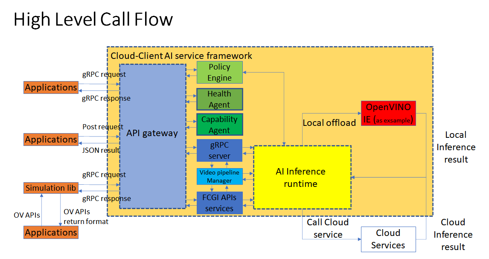
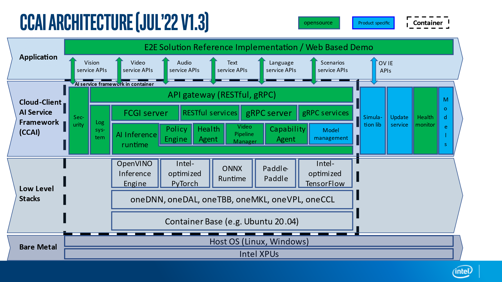

# 2. How does CCAI work

## 2.1 The high level call flow of CCAI (1.3 release)

The picture below is showing the basic working model of CCAI as a whole services
provider to provide high level APIs to external users of the services container.
Basically, there are 2 methods to use those services which are provided in
REST/gRPC APIs form. One is calling those APIs directly, the other one is
calling simulation lib APIs (we will talk simulation lib later).

## 2.2 CCAI (1.3 release) stack architecture

The architecture picture below is showing those modules and stacks in a high
level picture, it shows CCAI's components and their dependencies. It is up to
date for CCAI 1.3 release.

# 
