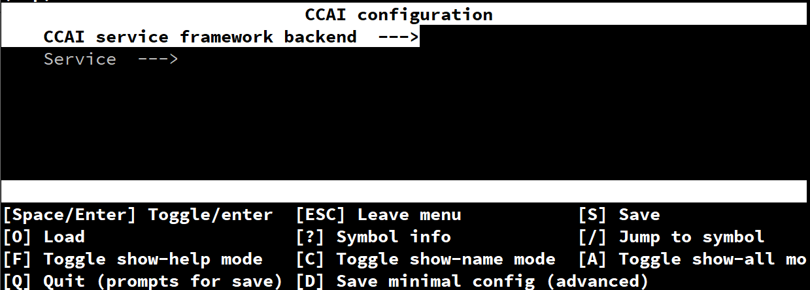
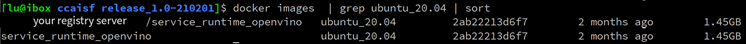
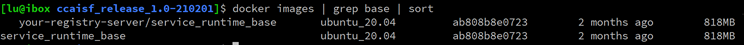

# 5. How to generate CCAI packages and container image

## 5.1 Build CCAI packages and generate CCAI container image form pre-built binaries

Note: Due to the model files for the current sample test cases are big enough, and the build process will also generate deb packages for those big model files, so the build process typically will need 4G memory if you'd like to build a full image/packages which include all services/models. it is better to have your build machine equipped with bigger memory, say 8G or bigger. Otherwise, you may encounter build failure due to out of memory. And if you have run related CCAI services (especially ASR/TTS/Classification ...) before building, due to those models already being loaded into memory, under this situation, one mitigation solution is : stop running unnecessary processes in the building machine, especially stop docker containers if possible.

Another option will be : only include specific models into the building process, the steps to do this will be shown in the following sections (section 4 below).

Docker files and service framework binaries which can be used to re-generate the docker image and deb packages which includes the whole logic of this framework

**Note: all components versions mentioned below in this document are for
example, they will change/update according to new features/new releases in
following days, so please replace the specific version with those exact
versions/releases depending on what you get.**

**1) Download and extract the tar file**

For example, download package to home/pub/release/ccaisf_release_1.0-210201.tar.gz

    $> tar xvf ccaisf_release_1.0-210201.tar.gz

**2) Build docker image**

    $> cd ccaisf_release_1.0-210201/

CCAI now supports several inference engines as backend engine, OpenVINO, PyTorch, ONNX runtime and TensorFlow. You can choose to use which one or multiple of them from the CCAI build menu, that also applies to some amples and example services. It can be achieved via menuconfig during theconfiguration process. The detailed instructions can be found in section **3.3 (How to build from source)** above.

Once finish those choice, then build container images as following:

    $> ./release_build.sh base_image
    
    $> ./release_build.sh openvino_image
    
    $> ./release_build.sh image

**3) Build deb packages (service_runtime, health-monitor, test)**

    $> ./release_build.sh package
**4) Build deb packages (models)**

    $> ./release_build.sh models_package

By default, only 3 model packages and 1 cl_cache package will be generated:

service-runtime-models-ocr_1.0-210201_all.deb

service-runtime-models-tts_1.0-210201_all.deb

service-runtime-models-wsj-dnn5b_1.0-210201_all.deb

service-runtime-models-cl-cache_1.0-210201_all.deb

If you want to build all model packages, you need to take the following steps:

**a), Edit file, 'package/models/debian/control', uncomment lines where you want the related models built into packages, the following lines are as example:**

    #Package: service-runtime-models-lspeech-s5-ext
    
    #Architecture: all
    
    #Depends: service-runtime, ${misc:Depends}
    
    #Description: service-runtime-models
    
    # service-runtime-models

    #Package: service-runtime-models-classification
    
    #Architecture: all
    
    #Depends: service-runtime, ${misc:Depends}
    
    #Description: service-runtime-models
    
    # service-runtime-models

    #Package: service-runtime-models-face-detection
    
    #Architecture: all
    
    #Depends: service-runtime, ${misc:Depends}
    
    #Description: service-runtime-models
    
    # service-runtime-models

    #Package: service-runtime-models-facial-landmarks
    
    #Architecture: all
    
    #Depends: service-runtime, ${misc:Depends}
    
    #Description: service-runtime-models
    
    # service-runtime-models

    #Package: service-runtime-models-deeplab
    
    #Architecture: all
    
    #Depends: service-runtime, ${misc:Depends}
    
    #Description: service-runtime-models
    
    # service-runtime-models

**b) Re-execute the model package build cmd**

    $> ./release_build.sh models_package

**5) Execute 'docker images' will list the docker images:**

        $> docker images
    
    REPOSITORY TAG ...
    
    service_runtime v1_20210129_121352 ...
    
    service_runtime_openvino ubuntu_20.04 ...
    
    service_runtime_base ubuntu_20.04 ...
    
    ...

**6) Deb packages will be generated under 'ccaisf_release_1.0-210201/packages'**

        $> ls ./packages
    
    package/service-runtime_1.0-210201_all.deb
    
    package/service-runtime-models-classification_1.0-210201_all.deb
    
    package/service-runtime-models-deeplab_1.0-210201_all.deb
    
    package/service-runtime-models-face-detection_1.0-210201_all.deb
    
    package/service-runtime-models-facial-landmarks_1.0-210201_all.deb
    
    package/service-runtime-models-lspeech-s5-ext_1.0-210201_all.deb
    
    package/service-runtime-models-ocr_1.0-210201_all.deb
    
    package/service-runtime-models-tts_1.0-210201_all.deb
    
    package/service-runtime-models-wsj-dnn5b_1.0-210201_all.deb
    
    package/service-runtime-models-cl-cache_1.0-210201_all.deb
    
    package/service-runtime-test_1.0-210201_all.deb

If you see the results of step 5) and 6), the build is successful. If you want to run the service framework on the current machine, you only need to install all the deb packages:

Note: If not for testing the OTA process, then please uninstall existing packages before installing the new ones to avoid "possible" conflicts with OTA logic.

    $> dpkg -i package/*.deb

If you want to run the AI service framework on other machines, there are two options.

Option 1:

Save the docker image to a tar file:

    $> docker save service_runtime:v1_20210129_121352 -o service_runtime_latest.tar

And then copy the 'service_runtime_latest.tar' and all deb packages to the other
machine, load the 'service_runtime_latest.tar' and install the deb packages on
the other machine:

    $> docker load -i service_runtime_latest.tar
    
    $> dpkg -i package/*.deb

Option 2:

If you have docker registry server, you can push the docker image, service_runtime:latest to your docker registry:

    $> docker tag service_runtime:v1_20210129_121352 <your registry>/service_runtime:latest
    
    $> docker push <your registry>/service_runtime:latest

And then pull the docker image on the other machine:

    $> docker pull <your registry>/service_runtime:latest

After that copy all deb packages to the other machine, and install all deb packages on the other machine:

    $> dpkg -i package/*.deb

## 5.2 How to build from source {#5.2}

Once you have access to the CCAI gitlab repo, please upload your RSA public key to CCAI project and follow the instructions below to check out the whole project.

### 5.2.1 download initial project - container {#5.2.1}

git clone this repo

This project is a general entry project which will help download other all needed sub-projects and construct CCAI framework from them. This means you don't need to clone other projects under this repository and build them one by one.
You just need to clone this project and follow the commands below to get all necessary dependencies.

    $> cd container/script/integration_workdir
    
    $> make defconfig

If you want change the default configuration, you can execute 'make menuconfig',

    $> make menuconfig

You can type 'Space/Enter' to expand a branch, or 'enable/disable' an option.

    $> make base_image

This command will get all dependencies for build CCAI and generate basic
container image which is the lowest image layer of CCAI framework image and
includes basic system libraries and commands for constructing a workable system.

    $> make inference_engine_image

This command will generate the 2nd layer on top of the basic layer from the step
above, this layer includes CCAI framework backend stacks like OpenVINO and
OpenCL driver etc.

    $> make

This command will generate the toppest layer which includes the core of CCAI framework, and all services which will provide all supported services in REST APIs and gRPC APIs.

Once you finished steps above, you will get a docker image, 'service_runtime'
and a folder 'service_runtime' under the folder, 'integration_workdir', to
launch CCAI, you only need to execute:

    $> cd ./service_runtime
    
    $> ./service_runtime.sh start

### 5.2.2 build host packages {#5.2.2}

    $> ../release.sh

This command will generate a tar file named 'ccaisf_release_xxx.tar.gz' under
the folder 'integration_workdir/release'. Please refer to Chapter 5.1 above to
build CCAI deb packages.

### 5.2.3 install CCAI services and image on host {#5.2.3}

Please refer to Chapter 5.1 above in detail on how to install CCAI.

## 5.3 How to check all component versions {#5.3}

The deb packages which include all *.service have a unified version, which can
be queried through 'dpkg' after install:

    $> dpkg -l | grep service-runtime

After build, the docker image ID will be saved in a file, 'docker_image'.
'docker_image' will be packaged into service-runtime_xxx.deb and finally
installed to '/opt/intel/service_runtime/docker_image'. service-runtime.service
will launch the docker image of this ID.

So, comparing the results of ' # cat /opt/intel/service_runtime/docker_image ' and the output of ' # docker ps' can be used to confirm whether the running container is a correct version,
for example:

    $> cat /opt/intel/service_runtime/docker_image
    
    sha256:8ee35d329533e9c76903767cbd03761a3cf70ff1ebd17dea85be84028a317b06
    
    $> docker ps
    
    CONTAINER ID IMAGE COMMAND CREATED STATUS PORTS NAMES
    
    2406a9bee2ea 8ee35d329533 "/start.sh" 17 minutes ago Up 17 minutes (unhealthy)
    0.0.0.0:8080-8081->8080-8081/tcp service_runtime_container

The 2 strings above should be matched (8ee35d329533).

## 5.4 Generate CCAI OTA image {#5.4}

On the current stage (for Penguin Peak project), CCAI defines 3 Docker layers
from top to bottom for constructing CCAI container image:

    service_runtime
    
    service_runtime_openvino
    
    service_runtime_base

Among them, the layer service_runtime is based on layer service_runtime_openvino, and the layer service_runtime_openvino is set up on top of the layer service_runtime_base. Once the whole container image is built, according to those instructions in the CCAI components build document, only the highest layer --- service_runtime needs to be installed to the OS of target devices because the dependent layers of the layer service_runtime will automatically be included into this image.

**VERY IMPORTANT:  
But, the images included service_runtime_base and service_runtime_openvino MUST
be saved as base for future use. In other words, for making incremental OTA
workable, you should save the 2 images:  
service_runtime_openvino  
service_runtime_base  
You could save them together with your build environment or also could save them
in your docker image registry for easy maintenance.**

When there is a new version of CCAI release, depending on the specific changes,
it could involve the changes to any of the 3 layers of the container image.

Under the situation where the 2 bottom layers --- the layer service_runtime_base
and the layer service_runtime_openvino are not changed, then you only need to
build the image for the highest layer --- service_runtime directly, and because
this layer is on top of the other 2 layers, generating the image will need the
images you saved as description above, which include the layer
service_runtime_openvino and service_runtime_base.

Under the situation where only service_runtime_base is not changed, then you
will need to build the image service_runtime_openvino and the image
service_runtime respectively with the saved image above which include the layer
service_runtime_base.

Under the situation where all 3 layers were changed, then you will have to build
all 3 images which included the 3 layers respectively. At this time, due to all
3 layers changed, you will not need any previous saved images. **BUT also, you
have to save those new generated images for any further incremental OTA images
build.**

Following, we show a few examples (only show how to build the Docker images, not
the packages) here for demonstrating the process:

**Example 1**, Integration for the first time (pre-install case) or for any
situation where the content in the layer service_runtime_base is changed, which means all images needed to be re-generated.  
a) Execute the commands below  

    $> ./release_build.sh base_image  
    $> ./release_build.sh openvino_image  
    $> ./release_build.sh image

You will get 3 Docker images as shown below:

b) The image service_runtime needs to be installed to OS on the target device, and the image service_runtime_openvino and the image service_runtime_base **need to be saved for future incremental OTA image creation**.

To ease your life for maintaining the latest version of the image service_runtime_openvino and the image service_runtime_base, you may push them to your registry server with tags, for example:

    $> docker tag **IMAGE_ID REGISTRY_SERVER**/service_runtime_openvino:ubuntu_20.04
    
    $> docker tag **IMAGE_ID REGISTRY_SERVER**/service_runtime_base:ubuntu_20.04  
    $> docker push **REGISTRY_SERVER**/service_runtime_openvino:ubuntu_20.04  
    $> docker push **REGISTRY_SERVER**/service_runtime_base:ubuntu_20.04

**Example 2**, There is a new CCAI release, only the image including the layer service_runtime is changed.  
a)Check Docker image in your integration environment or your docker image
registry, you must have the latest version of the image service_runtime_openvino on your machine for generating the image service_runtime on top of it. In your local machine, execute cmd:

    $> docker images

If there is no the image service_runtime_openvino found, you may need to pull it
from your registry server if you had pushed it before, and make a correct image
name with tag:  

    $> docker pull **REGISTRY_SERVER**/service_runtime_openvino:ubuntu_20.04  
    $> docker tag **REGISTRY_SERVER**/service_runtime_openvino:ubuntu_20.04
service_runtime_openvino:ubuntu_20.04

b) Build the image service_runtime following those instructions in CCAI build document

    $> ./release_build.sh image

You will get the Docker image service_runtime which should be installed to the OS of the target device.

**Example 3**, There is a new CCAI release, where both the layer
service_runtime_openvino and the layer service_runtime are changed.  
a) Check Docker image in your integration environment, you must have the latest version of service_runtime_base on your machine.  

    $> docker images

If there is no service_runtime_base, you may need to copy it from previous saved image, or pull it from your registry server, and make a correct image name with tag:  

    $> docker pull **REGISTRY_SERVER**/service_runtime_base:ubuntu_20.04  
    $> docker tag **REGISTRY_SERVER**/service_runtime_base:ubuntu_20.04
service_runtime_base:ubuntu_20.04

b) Build both the image service_runtime_openvino and the image service_runtime respectively.  

    $> ./release_build.sh openvino_image  
    $> ./release_build.sh image

  

c) The newly generated image service_runtime needs to be installed to the OS of the target device, and the newly generated image service_runtime_openvino needs to be updated to your registry server.

**Meanwhile, please note, the newly generated image service_runtime_openvino should be saved (in local build environment or in docker registry server) for future incremental OTA image creation.**

    $> docker tag **IMAGE_ID REGISTRY_SERVER**/service_runtime_openvino:ubuntu_20.04
    
    $> docker push **REGISTRY_SERVER**/service_runtime_openvino:ubuntu_20.04
